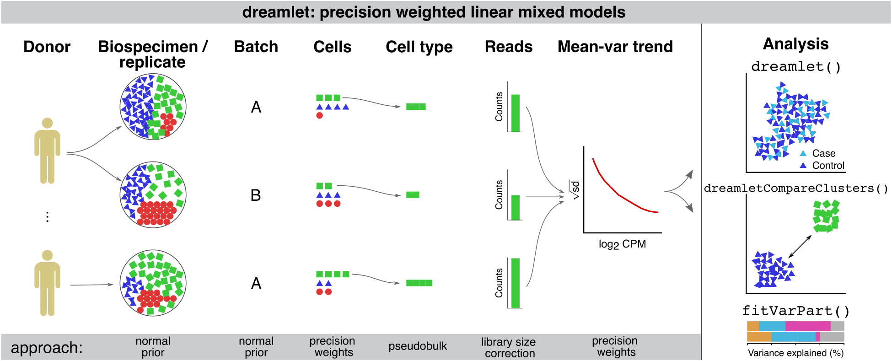

 <br> 


### Scalable differential expression analysis of single cell transcriptomics datasets with complex study designs


The [dreamlet]() package enables differential expression analysis on multi-sample single cell datasets using linear (mixed) models with precision weights.

Major functionality of `dreamlet` package using the [Bioconductor](https://www.bioconductor.org) [`SingleCellExperiment`](https://www.bioconductor.org/packages/SingleCellExperiment/) interface:

+ [`aggregateToPseudoBulk()`](reference/aggregateToPseudoBulk.html)       Fast evaluation of pseudobulk from <u>raw counts</u>
+ [`processAssays()`](reference/processAssays.html)                             Normalize aggregated <u>raw counts</u>, compute precision weights
+ [`fitVarPart()`](reference/fitVarPart.html)                                     Variance partitioning analysis
+ [`dreamlet()`](reference/dreamlet.html)                                           Differential expression analysis across <u>samples</u>
+ [`dreamletCompareClusters()`](reference/dreamletCompareClusters.html)  Differential expression analysis across <u>cell clusters</u>
+ [`zenith_gsa()`](reference/zenith_gsa-methods.html)                                      Gene set analysis with full spectrum of test statistics


## Motivation
<div style="text-align: justify">
Recent advances in single cell/nucleus transcriptomic technology has enabled collection of population-level data sets to study cell type specific gene expression differences associated with disease state, stimulus, and genetic regulation.  The scale of these data, complex study designs, and low read count per cell mean that characterizing cell type specific molecular mechanisms requires a user-friendly, purpose-build analytical framework.  We have developed the dreamlet package that applies a pseudobulk approach and fits a regression model for each gene and cell cluster to test differential expression across individuals associated with a trait of interest.  Use of precision-weighted linear mixed models enables accounting for repeated measures study designs, high dimensional batch effects, and varying sequencing depth or observed cells per biosample.   

## Dreamlet workflow



## Technical intro
Dreamlet further enables analysis of massive-scale of single cell/nucleus transcriptome datasets by addressing both CPU and memory usage limitations.  Dreamlet performs preprocessing and statistical analysis in parallel on multicore machines, and can distribute work across multiple nodes on a compute cluster.  Dreamlet also uses the [H5AD format](https://anndata.readthedocs.io/en/latest/index.html) for on-disk data storage to enable data processing in smaller chunks to dramatically reduce memory usage.
 
The dreamlet workflow easily integrates into the [Bioconductor](https://www.bioconductor.org) ecosystem, and uses the [`SingleCellExperiment`](https://www.bioconductor.org/packages/SingleCellExperiment/) class to facilitate compatibility with other analyses.  Beyond differential expression testing, dreamlet provides seamless integration of downstream analysis including quantifying sources of expression variation, gene set analysis using the full spectrum of gene-level t-statistics, testing differences in cell type composition and visualizing results.

Dreamlet builds on previous work on variance partitioning and differential expression using precision-weighted linear mixed models in the [variancePartition](https://bioconductor.org/packages/variancePartition/) package.  The dreamlet package is designed to be easily adopted by users of [variancePartition](https://bioconductor.org/packages/variancePartition/) and [limma](https://bioconductor.org/packages/limma/).

</div>

## Install
```r
# this should install dependencies too
devtools::install_github("GabrielHoffman/dreamlet")
```


### Dependencies
In case code above doesn't install these automatically:
```r
devtools::install_github("GabrielHoffman/variancePartition")
devtools::install_github("GabrielHoffman/zenith")
```


