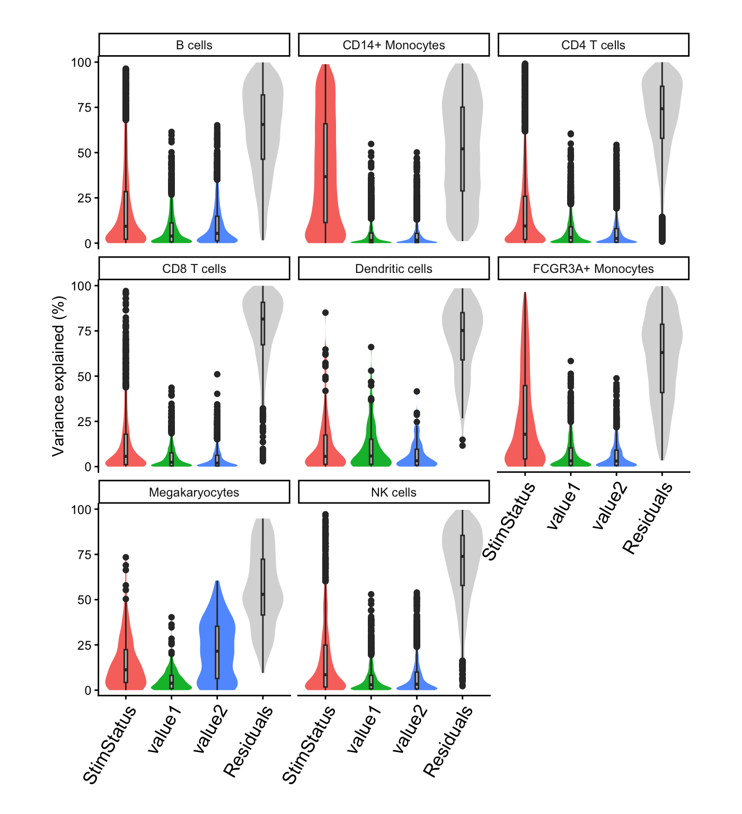

# Modeling continuous cell-level covariates

## Introduction

Since read counts are summed across cells in a pseudobulk approach,
modeling continuous cell-level covariates also requires a collapsing
step. Here we summarize the values of a variable from a set of cells
using the mean, and store the value for each cell type. Including these
variables in a regression formula uses the summarized values from the
corresponding cell type.

We demonstrate this feature on a lightly modified analysis of PBMCs from
8 individuals stimulated with interferon-β ([Kang, et al, 2018, Nature
Biotech](https://www.nature.com/articles/nbt.4042)).

## Standard processing

Here is the code from the main vignette:

``` r

library(dreamlet)
library(muscat)
library(ExperimentHub)
library(scater)

# Download data, specifying EH2259 for the Kang, et al study
eh <- ExperimentHub()
sce <- eh[["EH2259"]]

# only keep singlet cells with sufficient reads
sce <- sce[rowSums(counts(sce) > 0) > 0, ]
sce <- sce[, colData(sce)$multiplets == "singlet"]

# compute QC metrics
qc <- perCellQCMetrics(sce)

# remove cells with few or many detected genes
ol <- isOutlier(metric = qc$detected, nmads = 2, log = TRUE)
sce <- sce[, !ol]

# set variable indicating stimulated (stim) or control (ctrl)
sce$StimStatus <- sce$stim
```

In many datasets, continuous cell-level variables could be mapped reads,
gene count, mitochondrial rate, etc. There are no continuous cell-level
variables in this dataset, so we can simulate two from a normal
distribution:

``` r

sce$value1 <- rnorm(ncol(sce))
sce$value2 <- rnorm(ncol(sce))
```

## Pseudobulk

Now compute the pseudobulk using standard code:

``` r

sce$id <- paste0(sce$StimStatus, sce$ind)

# Create pseudobulk
pb <- aggregateToPseudoBulk(sce,
  assay = "counts",
  cluster_id = "cell",
  sample_id = "id",
  verbose = FALSE
)
```

The means per variable, cell type, and sample are stored in the
pseudobulk `SingleCellExperiment` object:

``` r

metadata(pb)$aggr_means
```

    ## # A tibble: 128 × 5
    ## # Groups:   cell [8]
    ##    cell    id       cluster   value1  value2
    ##    <fct>   <fct>      <dbl>    <dbl>   <dbl>
    ##  1 B cells ctrl101     3.96 -0.175   -0.0871
    ##  2 B cells ctrl1015    4.00  0.0386   0.0644
    ##  3 B cells ctrl1016    4     0.0154   0.0848
    ##  4 B cells ctrl1039    4.04  0.264   -0.396 
    ##  5 B cells ctrl107     4     0.0313  -0.0824
    ##  6 B cells ctrl1244    4    -0.122    0.0432
    ##  7 B cells ctrl1256    4.01  0.00290  0.0317
    ##  8 B cells ctrl1488    4.02 -0.0284   0.0136
    ##  9 B cells stim101     4.09 -0.151    0.0541
    ## 10 B cells stim1015    4.06 -0.0415   0.0719
    ## # ℹ 118 more rows

## Analysis

Including these variables in a regression formula uses the summarized
values from the corresponding cell type. This happens behind the scenes,
so the user doesn’t need to distinguish bewteen sample-level variables
stored in `colData(pb)` and cell-level variables stored in
`metadata(pb)$aggr_means`.

Variance partition and hypothesis testing proceeds as ususal:

``` r

form <- ~ StimStatus + value1 + value2

# Normalize and apply voom/voomWithDreamWeights
res.proc <- processAssays(pb, form, min.count = 5)

# run variance partitioning analysis
vp.lst <- fitVarPart(res.proc, form)

# Summarize variance fractions genome-wide for each cell type
plotVarPart(vp.lst, label.angle = 60)
```



``` r

# Differential expression analysis within each assay
res.dl <- dreamlet(res.proc, form)

# dreamlet results include coefficients for value1 and value2
res.dl
```

    ## class: dreamletResult 
    ## assays(8): B cells CD14+ Monocytes ... Megakaryocytes NK cells
    ## Genes:
    ##  min: 164 
    ##  max: 5262 
    ## details(7): assay n_retain ... n_errors error_initial
    ## coefNames(4): (Intercept) StimStatusstim value1 value2

## Details

A variable in `colData(sce)` is handled according to if the variable is

- continuous: the mean per donor/cell type is stored in
  `metadata(pb)$aggr_means`
- discrete
  - \[constant within each donor/cell type\] it is stored in
    `colData(pb)`
  - \[varies within each donor/cell type\] there is no good way to
    summarize it. The variable is dropped.

## Session Info

    ## R version 4.5.1 (2025-06-13)
    ## Platform: aarch64-apple-darwin23.6.0
    ## Running under: macOS Sonoma 14.7.1
    ## 
    ## Matrix products: default
    ## BLAS/LAPACK: /opt/homebrew/Cellar/openblas/0.3.30/lib/libopenblasp-r0.3.30.dylib;  LAPACK version 3.12.0
    ## 
    ## locale:
    ## [1] en_US.UTF-8/en_US.UTF-8/en_US.UTF-8/C/en_US.UTF-8/en_US.UTF-8
    ## 
    ## time zone: America/New_York
    ## tzcode source: internal
    ## 
    ## attached base packages:
    ## [1] stats4    stats     graphics  grDevices utils     datasets  methods  
    ## [8] base     
    ## 
    ## other attached packages:
    ##  [1] muscData_1.24.0             scater_1.38.0              
    ##  [3] scuttle_1.20.0              ExperimentHub_3.0.0        
    ##  [5] AnnotationHub_4.0.0         BiocFileCache_3.0.0        
    ##  [7] dbplyr_2.5.1                muscat_1.24.0              
    ##  [9] dreamlet_1.9.1              SingleCellExperiment_1.32.0
    ## [11] SummarizedExperiment_1.40.0 Biobase_2.70.0             
    ## [13] GenomicRanges_1.62.1        GenomeInfoDb_1.46.2        
    ## [15] Seqinfo_1.0.0               IRanges_2.44.0             
    ## [17] S4Vectors_0.48.0            BiocGenerics_0.56.0        
    ## [19] generics_0.1.4              MatrixGenerics_1.22.0      
    ## [21] matrixStats_1.5.0           variancePartition_1.40.2   
    ## [23] BiocParallel_1.44.0         limma_3.66.0               
    ## [25] ggplot2_4.0.1               BiocStyle_2.38.0           
    ## 
    ## loaded via a namespace (and not attached):
    ##   [1] fs_1.6.6                  bitops_1.0-9             
    ##   [3] httr_1.4.7                RColorBrewer_1.1-3       
    ##   [5] doParallel_1.0.17         Rgraphviz_2.54.0         
    ##   [7] numDeriv_2016.8-1.1       sctransform_0.4.3        
    ##   [9] tools_4.5.1               backports_1.5.0          
    ##  [11] utf8_1.2.6                R6_2.6.1                 
    ##  [13] metafor_4.8-0             mgcv_1.9-4               
    ##  [15] GetoptLong_1.1.0          withr_3.0.2              
    ##  [17] gridExtra_2.3             prettyunits_1.2.0        
    ##  [19] fdrtool_1.2.18            cli_3.6.5                
    ##  [21] textshaping_1.0.4         sandwich_3.1-1           
    ##  [23] labeling_0.4.3            slam_0.1-55              
    ##  [25] sass_0.4.10               KEGGgraph_1.70.0         
    ##  [27] SQUAREM_2021.1            mvtnorm_1.3-3            
    ##  [29] S7_0.2.1                  blme_1.0-7               
    ##  [31] pkgdown_2.2.0             mixsqp_0.3-54            
    ##  [33] systemfonts_1.3.1         zenith_1.12.0            
    ##  [35] dichromat_2.0-0.1         parallelly_1.46.1        
    ##  [37] invgamma_1.2              RSQLite_2.4.5            
    ##  [39] shape_1.4.6.1             gtools_3.9.5             
    ##  [41] dplyr_1.1.4               Matrix_1.7-4             
    ##  [43] metadat_1.4-0             ggbeeswarm_0.7.3         
    ##  [45] abind_1.4-8               lifecycle_1.0.5          
    ##  [47] yaml_2.3.12               edgeR_4.8.2              
    ##  [49] mathjaxr_2.0-0            gplots_3.3.0             
    ##  [51] SparseArray_1.10.8        grid_4.5.1               
    ##  [53] blob_1.3.0                crayon_1.5.3             
    ##  [55] lattice_0.22-7            beachmat_2.26.0          
    ##  [57] msigdbr_25.1.1            annotate_1.88.0          
    ##  [59] KEGGREST_1.50.0           pillar_1.11.1            
    ##  [61] knitr_1.51                ComplexHeatmap_2.26.0    
    ##  [63] rjson_0.2.23              boot_1.3-32              
    ##  [65] corpcor_1.6.10            future.apply_1.20.1      
    ##  [67] codetools_0.2-20          glue_1.8.0               
    ##  [69] data.table_1.18.0         vctrs_0.7.1              
    ##  [71] png_0.1-8                 Rdpack_2.6.5             
    ##  [73] gtable_0.3.6              assertthat_0.2.1         
    ##  [75] cachem_1.1.0              zigg_0.0.2               
    ##  [77] xfun_0.56                 rbibutils_2.4.1          
    ##  [79] S4Arrays_1.10.1           Rfast_2.1.5.2            
    ##  [81] reformulas_0.4.3.1        iterators_1.0.14         
    ##  [83] statmod_1.5.1             nlme_3.1-168             
    ##  [85] pbkrtest_0.5.5            bit64_4.6.0-1            
    ##  [87] filelock_1.0.3            progress_1.2.3           
    ##  [89] EnvStats_3.1.0            bslib_0.9.0              
    ##  [91] TMB_1.9.19                irlba_2.3.5.1            
    ##  [93] vipor_0.4.7               KernSmooth_2.23-26       
    ##  [95] otel_0.2.0                colorspace_2.1-2         
    ##  [97] rmeta_3.0                 DBI_1.2.3                
    ##  [99] DESeq2_1.50.2             tidyselect_1.2.1         
    ## [101] bit_4.6.0                 compiler_4.5.1           
    ## [103] curl_7.0.0                httr2_1.2.2              
    ## [105] graph_1.88.1              BiocNeighbors_2.4.0      
    ## [107] desc_1.4.3                DelayedArray_0.36.0      
    ## [109] bookdown_0.46             scales_1.4.0             
    ## [111] caTools_1.18.3            remaCor_0.0.20           
    ## [113] rappdirs_0.3.4            stringr_1.6.0            
    ## [115] digest_0.6.39             minqa_1.2.8              
    ## [117] rmarkdown_2.30            aod_1.3.3                
    ## [119] XVector_0.50.0            RhpcBLASctl_0.23-42      
    ## [121] htmltools_0.5.9           pkgconfig_2.0.3          
    ## [123] lme4_2.0-0                sparseMatrixStats_1.22.0 
    ## [125] lpsymphony_1.38.0         mashr_0.2.79             
    ## [127] fastmap_1.2.0             rlang_1.1.7              
    ## [129] GlobalOptions_0.1.3       htmlwidgets_1.6.4        
    ## [131] UCSC.utils_1.6.1          DelayedMatrixStats_1.32.0
    ## [133] farver_2.1.2              jquerylib_0.1.4          
    ## [135] IHW_1.38.0                zoo_1.8-15               
    ## [137] jsonlite_2.0.0            BiocSingular_1.26.1      
    ## [139] RCurl_1.98-1.17           magrittr_2.0.4           
    ## [141] Rcpp_1.1.1                viridis_0.6.5            
    ## [143] babelgene_22.9            EnrichmentBrowser_2.40.0 
    ## [145] stringi_1.8.7             MASS_7.3-65              
    ## [147] plyr_1.8.9                listenv_0.10.0           
    ## [149] parallel_4.5.1            ggrepel_0.9.6            
    ## [151] Biostrings_2.78.0         splines_4.5.1            
    ## [153] hms_1.1.4                 circlize_0.4.17          
    ## [155] locfit_1.5-9.12           ScaledMatrix_1.18.0      
    ## [157] reshape2_1.4.5            BiocVersion_3.22.0       
    ## [159] XML_3.99-0.20             evaluate_1.0.5           
    ## [161] RcppParallel_5.1.11-1     BiocManager_1.30.27      
    ## [163] nloptr_2.2.1              foreach_1.5.2            
    ## [165] tidyr_1.3.2               purrr_1.2.1              
    ## [167] future_1.69.0             clue_0.3-66              
    ## [169] scattermore_1.2           ashr_2.2-63              
    ## [171] rsvd_1.0.5                broom_1.0.11             
    ## [173] xtable_1.8-4              fANCOVA_0.6-1            
    ## [175] viridisLite_0.4.2         ragg_1.5.0               
    ## [177] truncnorm_1.0-9           tibble_3.3.1             
    ## [179] lmerTest_3.2-0            glmmTMB_1.1.14           
    ## [181] memoise_2.0.1             beeswarm_0.4.0           
    ## [183] AnnotationDbi_1.72.0      cluster_2.1.8.1          
    ## [185] globals_0.18.0            GSEABase_1.72.0
