# Dreamlet analysis of single cell RNA-seq

## Introduction

As the scale of single cell/nucleus RNA-seq has increased, so has the
complexity of study designs. Analysis of datasets with simple study
designs can be performed using linear model as in the [muscat
package](https://bioconductor.org/packages/muscat). Yet analysis of
datsets with complex study designs such as repeated measures or many
technical batches can benefit from linear mixed model analysis to model
to correlation structure between samples. We previously developed
[dream](https://doi.org/10.1093/bioinformatics/btaa687) to apply linear
mixed models to bulk RNA-seq data using a
[limma](https://bioconductor.org/packages/release/bioc/html/limma.html)-style
workflow. Dreamlet extends the previous work of dream and
[muscat](https://www.nature.com/articles/s41467-020-19894-4) to apply
linear mixed models to pseudobulk data. Dreamlet also supports linear
models and facilitates application of 1)
[variancePartition](https://bioconductor.org/packages/variancePartition)
to quantify the contribution of multiple variables to expression
variation, and 2) [zenith](https://github.com/GabrielHoffman/zenith) to
perform gene set analysis on the differential expression signatures.

## Installation

To install this package, start R (version “4.3”) and enter:

``` r

if (!require("BiocManager", quietly = TRUE)) {
  install.packages("BiocManager")
}

# Select release #1 or #2

# 1) Bioconductor release
BiocManager::install("dreamlet")

# 2) Latest stable release
devtools::install_github("DiseaseNeurogenomics/dreamlet")
```

## Process single cell count data

Here we perform analysis of PBMCs from 8 individuals stimulated with
interferon-β ([Kang, et al, 2018, Nature
Biotech](https://www.nature.com/articles/nbt.4042)). This is a small
dataset that does not have repeated measures or high dimensional batch
effects, so the sophisticated features of dreamlet are not strictly
necessary. But this gives us an opportunity to walk through a standard
dreamlet workflow.

### Preprocess data

Here, single cell RNA-seq data is downloaded from
[ExperimentHub](https://bioconductor.org/packages/ExperimentHub/).

``` r

library(dreamlet)
library(muscat)
library(ExperimentHub)
library(zenith)
library(scater)

# Download data, specifying EH2259 for the Kang, et al study
eh <- ExperimentHub()
sce <- eh[["EH2259"]]

sce$ind = as.character(sce$ind)

# only keep singlet cells with sufficient reads
sce <- sce[rowSums(counts(sce) > 0) > 0, ]
sce <- sce[, colData(sce)$multiplets == "singlet"]

# compute QC metrics
qc <- perCellQCMetrics(sce)

# remove cells with few or many detected genes
ol <- isOutlier(metric = qc$detected, nmads = 2, log = TRUE)
sce <- sce[, !ol]

# set variable indicating stimulated (stim) or control (ctrl)
sce$StimStatus <- sce$stim
```

### Aggregate to pseudobulk

Dreamlet, like muscat, performs analysis at the pseudobulk-level by
summing *raw counts* across cells for a given sample and cell type.
`aggregateToPseudoBulk` is substantially faster for large on-disk
datasets than
[`muscat::aggregateData`](https://rdrr.io/bioc/muscat/man/aggregateData.html).

``` r

# Since 'ind' is the individual and 'StimStatus' is the stimulus status,
# create unique identifier for each sample
sce$id <- paste0(sce$StimStatus, sce$ind)

# Create pseudobulk data by specifying cluster_id and sample_id
# Count data for each cell type is then stored in the `assay` field
# assay: entry in assayNames(sce) storing raw counts
# cluster_id: variable in colData(sce) indicating cell clusters
# sample_id: variable in colData(sce) indicating sample id for aggregating cells
pb <- aggregateToPseudoBulk(sce,
  assay = "counts",
  cluster_id = "cell",
  sample_id = "id",
  verbose = FALSE
)

# one 'assay' per cell type
assayNames(pb)
```

    ## [1] "B cells"           "CD14+ Monocytes"   "CD4 T cells"      
    ## [4] "CD8 T cells"       "Dendritic cells"   "FCGR3A+ Monocytes"
    ## [7] "Megakaryocytes"    "NK cells"

## Voom for pseudobulk

Apply [voom](https://rdrr.io/bioc/limma/man/voom.html)-style
normalization for pseudobulk counts within each cell cluster using
[voomWithDreamWeights](https://gabrielhoffman.github.io/variancePartition/reference/voomWithDreamWeights.html)
to handle random effects (if specified).

``` r

# Normalize and apply voom/voomWithDreamWeights
res.proc <- processAssays(pb, ~StimStatus, min.count = 5)

# the resulting object of class dreamletProcessedData stores
# normalized data and other information
res.proc
```

    ## class: dreamletProcessedData 
    ## assays(8): B cells CD14+ Monocytes ... Megakaryocytes NK cells
    ## colData(4): ind stim multiplets StimStatus
    ## metadata(3): cell id cluster
    ## Samples:
    ##  min: 13 
    ##  max: 16
    ## Genes:
    ##  min: 164 
    ##  max: 5262 
    ## details(7): assay n_retain ... n_errors error_initial

[`processAssays()`](http://DiseaseNeurogenomics.github.io/dreamlet/reference/processAssays.md)
retains samples with at least `min.cells` in a given cell type. While
dropping a few samples usually is not a problem, in some cases dropping
sames can mean that a variable included in the regression formula no
longer has any variation. For example, dropping all stimulated samples
from analysis of a given cell type would be mean the variable
`StimStatus` has no variation and is perfectly colinear with the
intercept term. This colinearity issue is detected internally and
variables with these problem are dropped from the regression formula for
that particular cell type. The number of samples retained and the
resulting formula used in each cell type can be accessed as follows. In
this analysis, samples are dropped from 3 cell types but the original
formula remains valid in each case.

``` r

# view details of dropping samples
details(res.proc)
```

    ##               assay n_retain     formula formDropsTerms n_genes n_errors
    ## 1           B cells       16 ~StimStatus          FALSE    1961        0
    ## 2   CD14+ Monocytes       16 ~StimStatus          FALSE    3087        0
    ## 3       CD4 T cells       16 ~StimStatus          FALSE    5262        0
    ## 4       CD8 T cells       16 ~StimStatus          FALSE    1030        0
    ## 5   Dendritic cells       13 ~StimStatus          FALSE     164        0
    ## 6 FCGR3A+ Monocytes       16 ~StimStatus          FALSE    1160        0
    ## 7    Megakaryocytes       13 ~StimStatus          FALSE     172        0
    ## 8          NK cells       16 ~StimStatus          FALSE    1656        0
    ##   error_initial
    ## 1         FALSE
    ## 2         FALSE
    ## 3         FALSE
    ## 4         FALSE
    ## 5         FALSE
    ## 6         FALSE
    ## 7         FALSE
    ## 8         FALSE

Here the mean-variance trend from voom is shown for each cell type. Cell
types with sufficient number of cells and reads show a clear
mean-variance trend. While in rare cell types like megakaryocytes, fewer
genes have sufficient reads and the trend is less apparent.

``` r

# show voom plot for each cell clusters
plotVoom(res.proc)
```

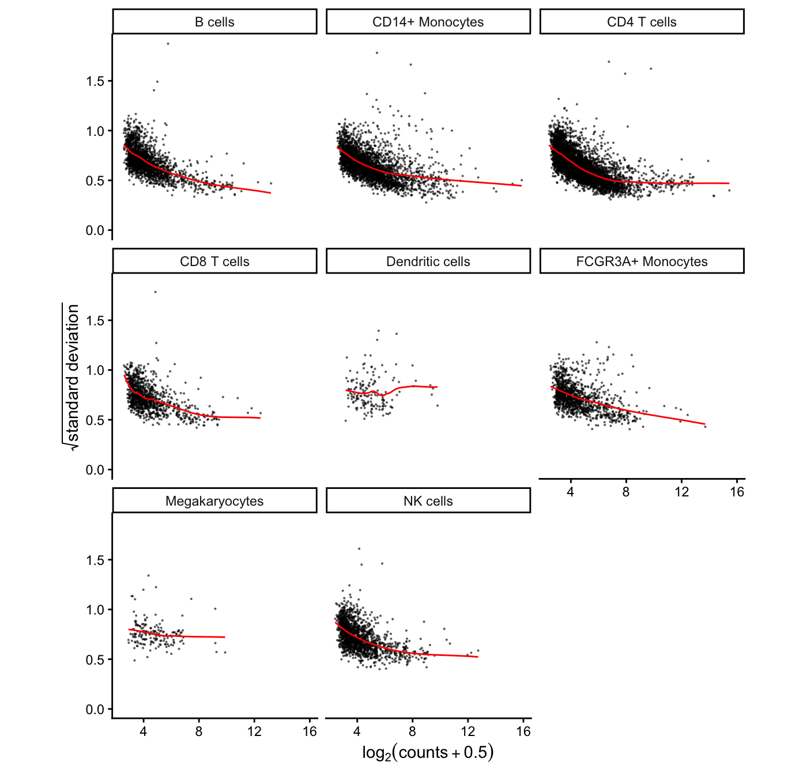

``` r

# Show plots for subset of cell clusters
# plotVoom( res.proc[1:3] )

# Show plots for one cell cluster
# plotVoom( res.proc[["B cells"]])
```

## Variance partitioning

The
[variancePartition](http://bioconductor.org/packages/variancePartition/)
package uses linear and linear mixed models to quanify the contribution
of multiple sources of expression variation at the gene-level. For each
gene it fits a linear (mixed) model and evalutes the fraction of
expression variation explained by each variable.

Variance fractions can be visualized at the gene-level for each cell
type using a bar plot, or genome-wide using a violin plot.

``` r

# run variance partitioning analysis
vp.lst <- fitVarPart(res.proc, ~StimStatus)
```

``` r

# Show variance fractions at the gene-level for each cell type
genes <- vp.lst$gene[2:4]
plotPercentBars(vp.lst[vp.lst$gene %in% genes, ])
```

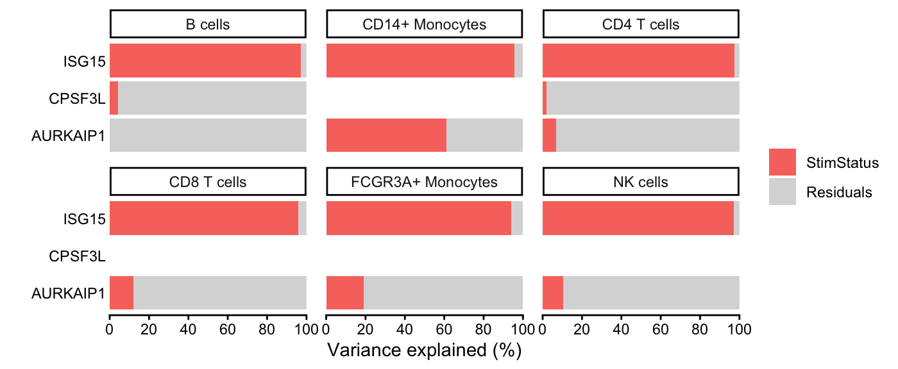

``` r

# Summarize variance fractions genome-wide for each cell type
plotVarPart(vp.lst, label.angle = 60)
```

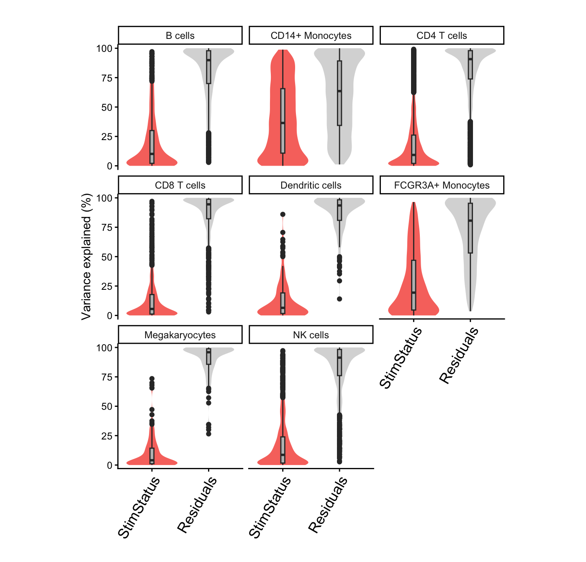

## Differential expression

Since the normalized expression data and metadata are stored within
`res.proc`, only the regression formula remains to be specified. Here we
only included the stimulus status, but analyses of larger datasets can
include covariates and random effects. With formula `~ StimStatus`, an
intercept is fit and coefficient `StimStatusstim` log fold change
between simulated and controls.

``` r

# Differential expression analysis within each assay,
# evaluated on the voom normalized data
res.dl <- dreamlet(res.proc, ~StimStatus)

# names of estimated coefficients
coefNames(res.dl)
```

    ## [1] "(Intercept)"    "StimStatusstim"

``` r

# the resulting object of class dreamletResult
# stores results and other information
res.dl
```

    ## class: dreamletResult 
    ## assays(8): B cells CD14+ Monocytes ... Megakaryocytes NK cells
    ## Genes:
    ##  min: 164 
    ##  max: 5262 
    ## details(7): assay n_retain ... n_errors error_initial
    ## coefNames(2): (Intercept) StimStatusstim

### Volcano plots

The volcano plot can indicate the strength of the differential
expression signal with each cell type. Red points indicate FDR \< 0.05.

``` r

plotVolcano(res.dl, coef = "StimStatusstim")
```

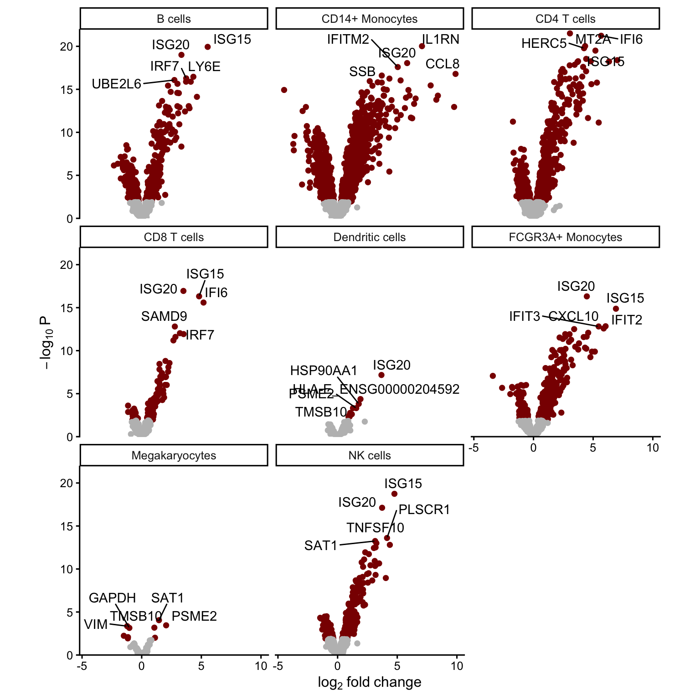

### Gene-level heatmap

For each cell type and specified gene, show z-statistic from `dreamlet`
analysis. Grey indicates that insufficient reads were observed to
include the gene in the analysis.

``` r

genes <- c("ISG20", "ISG15")
plotGeneHeatmap(res.dl, coef = "StimStatusstim", genes = genes)
```

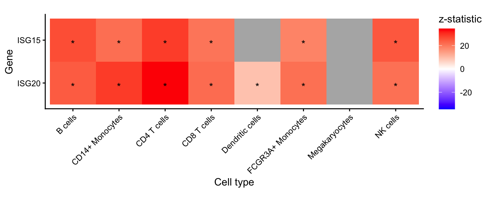

### Extract results

Each entry in `res.dl` stores a model fit by
[`dream()`](https://rdrr.io/bioc/variancePartition/man/dream-method.html),
and results can be extracted using
[`topTable()`](https://rdrr.io/pkg/limma/man/toptable.html) as in
`limma` by specifying the coefficient of interest. The results shows the
gene name, log fold change, average expression, t-statistic, p-value,
FDR (i.e. adj.P.Val).

``` r

# results from full analysis
topTable(res.dl, coef = "StimStatusstim")
```

    ## DataFrame with 10 rows and 9 columns
    ##              assay          ID     logFC   AveExpr         t     P.Value
    ##        <character> <character> <numeric> <numeric> <numeric>   <numeric>
    ## 1      CD4 T cells       ISG20   3.05455  10.40388   34.4774 3.14046e-22
    ## 2      CD4 T cells        IFI6   5.66980   8.52892   33.5813 5.89835e-22
    ## 3      CD4 T cells        MT2A   4.32697   7.80640   29.8959 9.44958e-21
    ## 4  CD14+ Monocytes       IL1RN   7.07251   7.79103   35.1828 9.58042e-21
    ## 5          B cells       ISG15   5.53079  10.20272   26.2270 1.16025e-20
    ## 6      CD4 T cells       HERC5   4.23629   6.74189   29.2009 1.65334e-20
    ## 7      CD4 T cells       ISG15   5.18872  10.06906   28.4163 3.15713e-20
    ## 8          B cells       ISG20   3.33103  11.38360   24.1402 9.83897e-20
    ## 9         NK cells       ISG15   4.76379  11.01479   24.7131 1.81450e-19
    ## 10     CD4 T cells     TNFSF10   4.41588   7.49081   25.8759 2.89593e-19
    ##      adj.P.Val         B     z.std
    ##      <numeric> <numeric> <numeric>
    ## 1  4.27395e-18   40.9592   34.4774
    ## 2  4.27395e-18   40.1636   33.5813
    ## 3  3.36287e-17   37.4905   29.8959
    ## 4  3.36287e-17   36.7737   35.1828
    ## 5  3.36287e-17   37.1705   26.2270
    ## 6  3.99337e-17   36.7596   29.2009
    ## 7  6.53617e-17   36.3919   28.4163
    ## 8  1.78233e-16   35.1770   24.1402
    ## 9  2.92175e-16   34.4633   24.7131
    ## 10 4.19679e-16   34.1274   25.8759

``` r

# only B cells
topTable(res.dl[["B cells"]], coef = "StimStatusstim")
```

    ##           logFC   AveExpr        t      P.Value    adj.P.Val        B
    ## ISG15  5.530786 10.202722 26.22702 1.160249e-20 2.275249e-17 37.17046
    ## ISG20  3.331031 11.383603 24.14017 9.838971e-20 9.647111e-17 35.17704
    ## LY6E   4.331290  8.706648 19.16241 3.474679e-17 2.271282e-14 29.27957
    ## IRF7   3.730427  8.678591 18.84058 5.310505e-17 2.603475e-14 28.88289
    ## UBE2L6 2.741292  9.241028 18.50765 8.290835e-17 3.251666e-14 28.47212
    ## EPSTI1 3.716921  8.107930 18.18089 1.292430e-16 3.651223e-14 27.96522
    ## PLSCR1 4.113193  8.271191 18.17475 1.303343e-16 3.651223e-14 27.96187
    ## IFITM2 2.999742  8.731566 17.76966 2.282011e-16 5.593779e-14 27.46272
    ## SAT1   2.206045  9.657178 17.41720 3.748297e-16 8.167123e-14 26.94871
    ## SOCS1  2.432287  8.588454 16.28257 1.965142e-15 3.853644e-13 25.32548

### Forest plot

A forest plot shows the log fold change and standard error of a given
gene across all cell types. The color indicates the FDR.

``` r

plotForest(res.dl, coef = "StimStatusstim", gene = "ISG20")
```

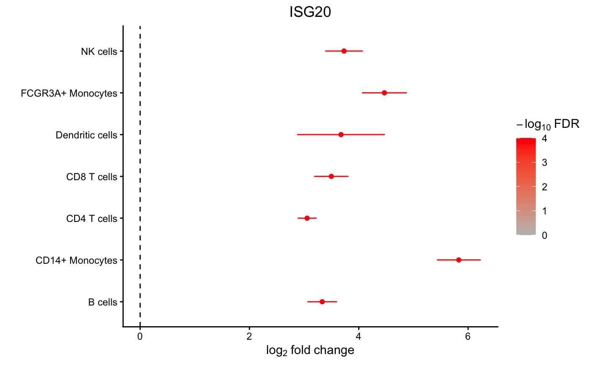

### Box plot

Examine the expression of ISG20 between stimulation conditions within
CD14+ Monocytes. Use
[`extractData()`](http://DiseaseNeurogenomics.github.io/dreamlet/reference/extractData-methods.md)
to create a `tibble` with gene expression data and metadata from
[`colData()`](https://rdrr.io/pkg/SummarizedExperiment/man/SummarizedExperiment-class.html)
from one cell type.

``` r

# get data
df <- extractData(res.proc, "CD14+ Monocytes", genes = "ISG20")

# set theme
thm <- theme_classic() +
  theme(aspect.ratio = 1, plot.title = element_text(hjust = 0.5))

# make plot
ggplot(df, aes(StimStatus, ISG20)) +
  geom_boxplot() +
  thm +
  ylab(bquote(Expression ~ (log[2] ~ CPM))) +
  ggtitle("ISG20")
```

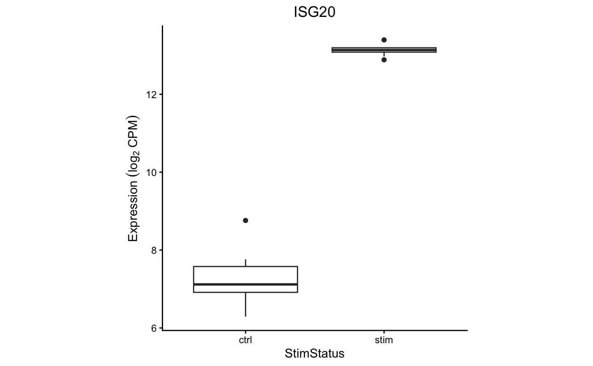

### Advanced used of contrasts

A hypothesis test of the *difference* between two or more coefficients
can be performed using contrasts. The contrast matrix is evaluated for
each cell type in the backend, so only the contrast string must be
supplied to
[`dreamlet()`](http://DiseaseNeurogenomics.github.io/dreamlet/reference/dreamlet.md).

``` r

# create a contrasts called 'Diff' that is the difference between expression
# in the stimulated and controls.
# More than one can be specified
contrasts <- c(Diff = "StimStatusstim - StimStatusctrl")

# Evalaute the regression model without an intercept term.
# Instead estimate the mean expression in stimulated, controls and then
# set Diff to the difference between the two
res.dl2 <- dreamlet(res.proc, ~ 0 + StimStatus, contrasts = contrasts)

# see estimated coefficients
coefNames(res.dl2)
```

    ## [1] "Diff"           "StimStatusctrl" "StimStatusstim"

``` r

# Volcano plot of Diff
plotVolcano(res.dl2[1:2], coef = "Diff")
```

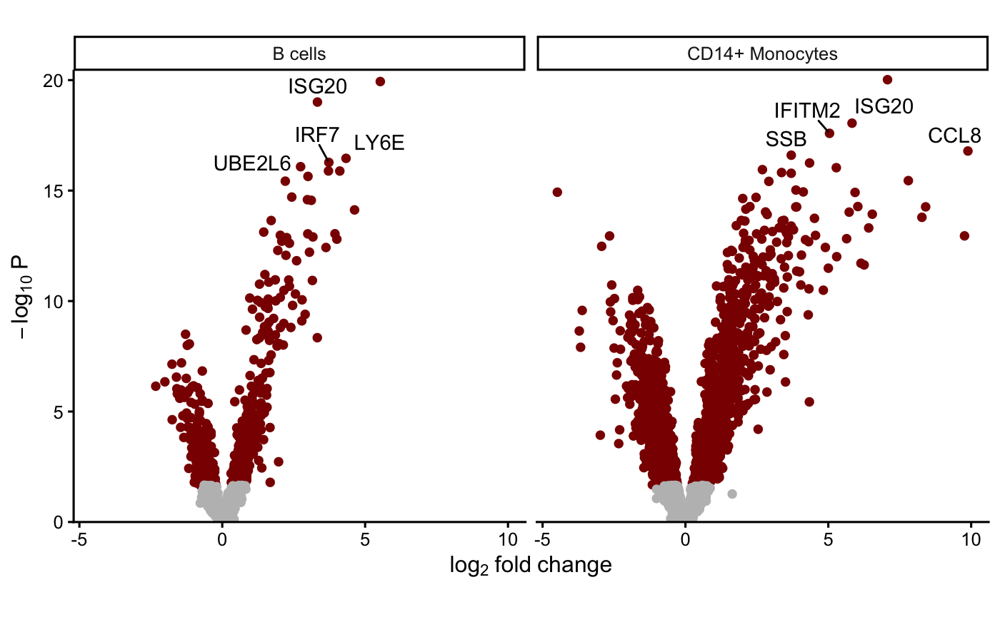

This new `Diff` variable can then be used downstream for analysis asking
for a coefficient. But note that since there is no intercept term in
this model, the meaning of `StimStatusstim` changes here. When the
formula is `0 + StimStatus` then `StimStatusstim` is the mean expression
in stimulated samples.

For further information about using contrasts see
[makeContrastsDream()](https://gabrielhoffman.github.io/variancePartition/reference/makeContrastsDream.html)
and
[vignette](https://gabrielhoffman.github.io/variancePartition/articles/dream.html#advanced-hypothesis-testing-1).

## Gene set analysis

While standard enrichment methods like Fishers exact test, requires
specifying a FDR cutoff to identify differentially expressed genes.
However, dichotomizing differential expression results is often too
simple and ignores the quantitative variation captured by the
differential expression test statistics. Here we use `zenith`, a wrapper
for [`limma::camera`](https://rdrr.io/bioc/limma/man/camera.html), to
perform gene set analysis using the full spectrum of differential
expression test statistics. `zenith/camera` is a [competetive
test](https://www.nature.com/articles/nrg.2016.29) that compares the
mean test statistic for genes in a given gene set, to genes not in that
set while accounting for correlation between genes.

Here, `zenith_gsa` takes a `dreamletResult` object, the coefficient of
interest, and gene sets as a `GeneSetCollection` object from
[GSEABase](https://bioconductor.org/packages/GSEABase/).

``` r

# Load Gene Ontology database
# use gene 'SYMBOL', or 'ENSEMBL' id
# use get_MSigDB() to load MSigDB
# Use Cellular Component (i.e. CC) to reduce run time here
go.gs <- get_GeneOntology("CC", to = "SYMBOL")

# Run zenith gene set analysis on result of dreamlet
res_zenith <- zenith_gsa(res.dl, coef = "StimStatusstim", go.gs)

# examine results for each ell type and gene set
head(res_zenith)
```

    ##     assay           coef
    ## 1 B cells StimStatusstim
    ## 2 B cells StimStatusstim
    ## 3 B cells StimStatusstim
    ## 4 B cells StimStatusstim
    ## 5 B cells StimStatusstim
    ## 6 B cells StimStatusstim
    ##                                                        Geneset NGenes
    ## 1                                GO0022626: cytosolic ribosome     77
    ## 2                 GO0022625: cytosolic large ribosomal subunit     45
    ## 3 GO0090575: RNA polymerase II transcription regulator complex     38
    ## 4                                   GO0032587: ruffle membrane     13
    ## 5                                    GO0005925: focal adhesion    111
    ## 6                           GO0030055: cell-substrate junction    111
    ##   Correlation      delta        se      p.less  p.greater      PValue Direction
    ## 1        0.01 -1.1189600 0.3494488 0.003197077 0.99680292 0.006394153      Down
    ## 2        0.01 -1.0609674 0.4129425 0.011134062 0.98886594 0.022268124      Down
    ## 3        0.01  1.0388011 0.4381026 0.983689509 0.01631049 0.032620982        Up
    ## 4        0.01 -1.5672380 0.6746900 0.017880611 0.98211939 0.035761223      Down
    ## 5        0.01 -0.7188655 0.3193516 0.020487674 0.97951233 0.040975349      Down
    ## 6        0.01 -0.7188655 0.3193516 0.020487674 0.97951233 0.040975349      Down
    ##         FDR
    ## 1 0.2661423
    ## 2 0.4992161
    ## 3 0.5028482
    ## 4 0.5277951
    ## 5 0.5573183
    ## 6 0.5573183

### Heatmap of top genesets

``` r

# for each cell type select 5 genesets with largest t-statistic
# and 1 geneset with the lowest
# Grey boxes indicate the gene set could not be evaluted because
#    to few genes were represented
plotZenithResults(res_zenith, 5, 1)
```

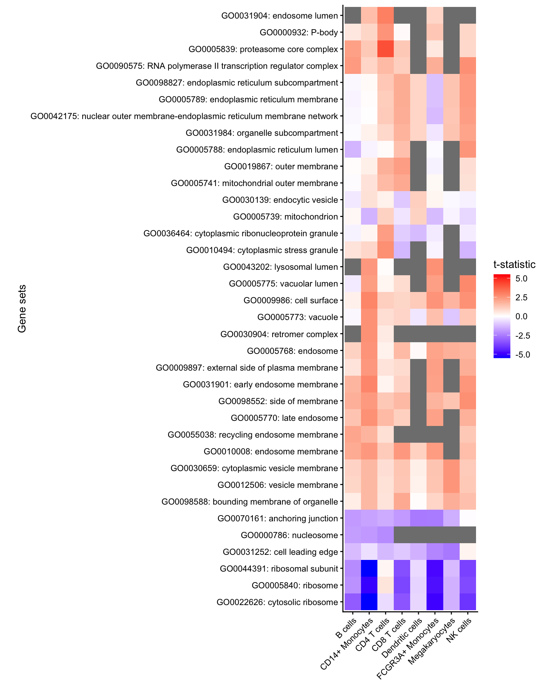

#### All gene sets with FDR \< 30%

Here, show all genes with FDR \< 5% in any cell type

``` r

# get genesets with FDR < 30%
# Few significant genesets because uses Cellular Component (i.e. CC)
gs <- unique(res_zenith$Geneset[res_zenith$FDR < 0.3])

# keep only results of these genesets
df <- res_zenith[res_zenith$Geneset %in% gs, ]

# plot results, but with no limit based on the highest/lowest t-statistic
plotZenithResults(df, Inf, Inf)
```

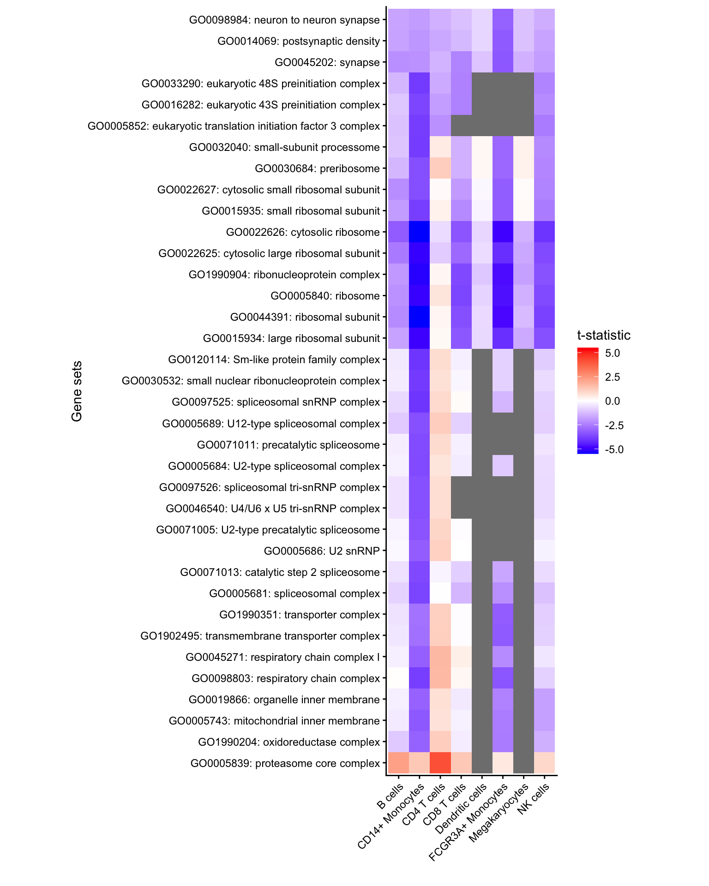

## Comparing expression in clusters

Identifying genes that are differentially expressed between cell
clusters incorporates a paired analysis design, since each individual is
observed for each cell cluster.

``` r

# test differential expression between B cells and the rest of the cell clusters
ct.pairs <- c("CD4 T cells", "rest")

fit <- dreamletCompareClusters(pb, ct.pairs, method = "fixed")

# The coefficient 'compare' is the value logFC between test and baseline:
# compare = cellClustertest - cellClusterbaseline
df_Bcell <- topTable(fit, coef = "compare")

head(df_Bcell)
```

    ##                             logFC   AveExpr         t      P.Value    adj.P.Val
    ## TYROBP                  -7.414914  7.917618 -90.80445 6.842120e-32 3.215797e-28
    ## FTL                     -4.940092 13.169468 -66.22295 1.268317e-28 2.980544e-25
    ## CD63                    -5.078535  8.760309 -59.02003 1.962995e-27 3.075358e-24
    ## C15orf48                -7.280995  8.398874 -54.88795 1.101340e-26 1.294075e-23
    ## HLA-DRA_ENSG00000204287 -6.420347  8.865795 -52.50758 3.155315e-26 2.965996e-23
    ## CCL2                    -7.288475  8.725990 -52.05456 3.875641e-26 3.035919e-23
    ##                                B
    ## TYROBP                  61.56044
    ## FTL                     55.69682
    ## CD63                    52.81595
    ## C15orf48                51.05221
    ## HLA-DRA_ENSG00000204287 50.11427
    ## CCL2                    49.86496

## Gene-cluster specificity

Evaluate the specificity of each gene for each cluster, retaining only
highly expressed genes:

``` r

df_cts <- cellTypeSpecificity(pb)

# retain only genes with total CPM summed across cell type > 100
df_cts <- df_cts[df_cts$totalCPM > 100, ]

# Violin plot of specificity score for each cell type
plotViolin(df_cts)
```

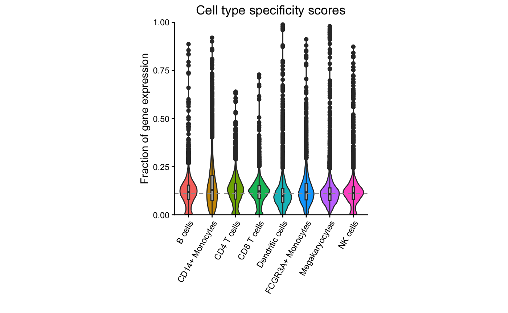

Highlight expression fraction for most specific gene from each cell
type:

``` r

genes <- rownames(df_cts)[apply(df_cts, 2, which.max)]
plotPercentBars(df_cts, genes = genes)
```

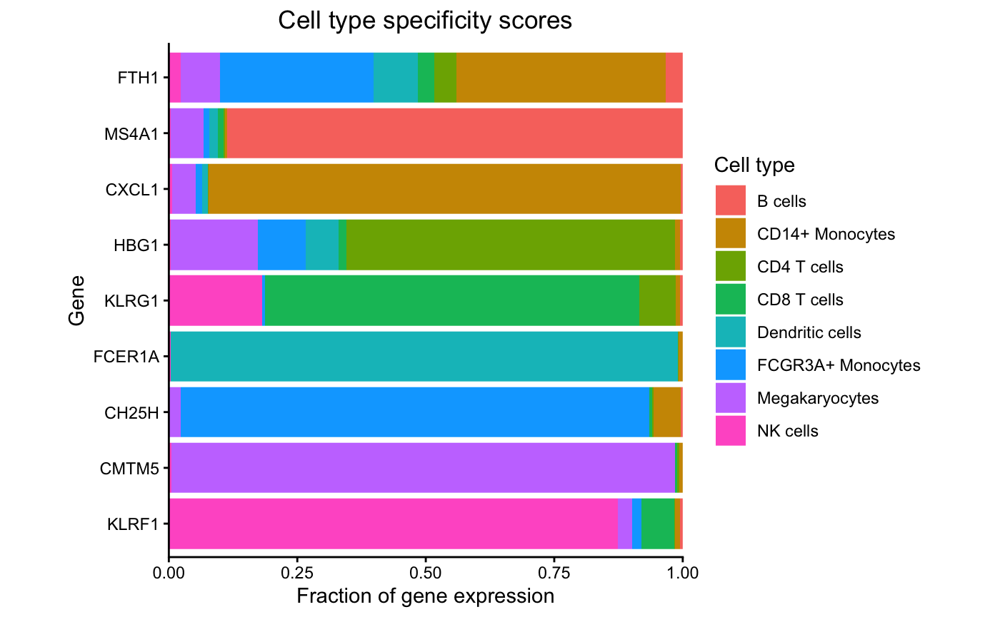

``` r

dreamlet::plotHeatmap(df_cts, genes = genes)
```

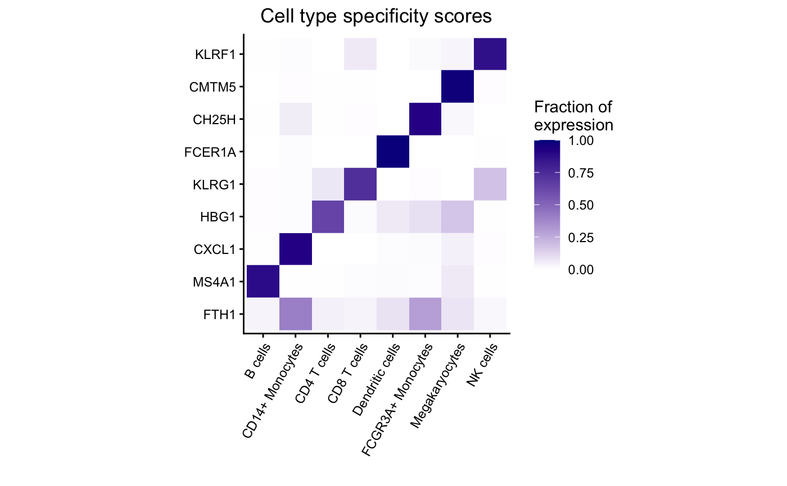

## Session Info

    ## R version 4.5.1 (2025-06-13)
    ## Platform: aarch64-apple-darwin23.6.0
    ## Running under: macOS Sonoma 14.7.1
    ## 
    ## Matrix products: default
    ## BLAS/LAPACK: /opt/homebrew/Cellar/openblas/0.3.30/lib/libopenblasp-r0.3.30.dylib;  LAPACK version 3.12.0
    ## 
    ## locale:
    ## [1] en_US.UTF-8/en_US.UTF-8/en_US.UTF-8/C/en_US.UTF-8/en_US.UTF-8
    ## 
    ## time zone: America/New_York
    ## tzcode source: internal
    ## 
    ## attached base packages:
    ## [1] stats4    stats     graphics  grDevices utils     datasets  methods  
    ## [8] base     
    ## 
    ## other attached packages:
    ##  [1] GO.db_3.22.0                org.Hs.eg.db_3.22.0        
    ##  [3] AnnotationDbi_1.72.0        muscData_1.24.0            
    ##  [5] scater_1.38.0               scuttle_1.20.0             
    ##  [7] zenith_1.12.0               ExperimentHub_3.0.0        
    ##  [9] AnnotationHub_4.0.0         BiocFileCache_3.0.0        
    ## [11] dbplyr_2.5.1                muscat_1.24.0              
    ## [13] dreamlet_1.9.1              SingleCellExperiment_1.32.0
    ## [15] SummarizedExperiment_1.40.0 Biobase_2.70.0             
    ## [17] GenomicRanges_1.62.1        GenomeInfoDb_1.46.2        
    ## [19] Seqinfo_1.0.0               IRanges_2.44.0             
    ## [21] S4Vectors_0.48.0            BiocGenerics_0.56.0        
    ## [23] generics_0.1.4              MatrixGenerics_1.22.0      
    ## [25] matrixStats_1.5.0           variancePartition_1.40.2   
    ## [27] BiocParallel_1.44.0         limma_3.66.0               
    ## [29] ggplot2_4.0.1               BiocStyle_2.38.0           
    ## 
    ## loaded via a namespace (and not attached):
    ##   [1] fs_1.6.6                  bitops_1.0-9             
    ##   [3] httr_1.4.7                RColorBrewer_1.1-3       
    ##   [5] doParallel_1.0.17         Rgraphviz_2.54.0         
    ##   [7] numDeriv_2016.8-1.1       sctransform_0.4.3        
    ##   [9] tools_4.5.1               backports_1.5.0          
    ##  [11] R6_2.6.1                  metafor_4.8-0            
    ##  [13] mgcv_1.9-4                GetoptLong_1.1.0         
    ##  [15] withr_3.0.2               gridExtra_2.3            
    ##  [17] prettyunits_1.2.0         fdrtool_1.2.18           
    ##  [19] cli_3.6.5                 textshaping_1.0.4        
    ##  [21] sandwich_3.1-1            labeling_0.4.3           
    ##  [23] slam_0.1-55               sass_0.4.10              
    ##  [25] KEGGgraph_1.70.0          SQUAREM_2021.1           
    ##  [27] mvtnorm_1.3-3             S7_0.2.1                 
    ##  [29] blme_1.0-7                pkgdown_2.2.0            
    ##  [31] mixsqp_0.3-54             systemfonts_1.3.1        
    ##  [33] dichromat_2.0-0.1         parallelly_1.46.1        
    ##  [35] invgamma_1.2              RSQLite_2.4.5            
    ##  [37] shape_1.4.6.1             gtools_3.9.5             
    ##  [39] dplyr_1.1.4               Matrix_1.7-4             
    ##  [41] metadat_1.4-0             ggbeeswarm_0.7.3         
    ##  [43] abind_1.4-8               lifecycle_1.0.5          
    ##  [45] yaml_2.3.12               edgeR_4.8.2              
    ##  [47] mathjaxr_2.0-0            gplots_3.3.0             
    ##  [49] SparseArray_1.10.8        grid_4.5.1               
    ##  [51] blob_1.3.0                crayon_1.5.3             
    ##  [53] lattice_0.22-7            beachmat_2.26.0          
    ##  [55] msigdbr_25.1.1            annotate_1.88.0          
    ##  [57] KEGGREST_1.50.0           pillar_1.11.1            
    ##  [59] knitr_1.51                ComplexHeatmap_2.26.0    
    ##  [61] rjson_0.2.23              boot_1.3-32              
    ##  [63] corpcor_1.6.10            future.apply_1.20.1      
    ##  [65] codetools_0.2-20          glue_1.8.0               
    ##  [67] data.table_1.18.0         vctrs_0.7.1              
    ##  [69] png_0.1-8                 Rdpack_2.6.5             
    ##  [71] gtable_0.3.6              assertthat_0.2.1         
    ##  [73] cachem_1.1.0              zigg_0.0.2               
    ##  [75] xfun_0.56                 rbibutils_2.4.1          
    ##  [77] S4Arrays_1.10.1           Rfast_2.1.5.2            
    ##  [79] reformulas_0.4.3.1        iterators_1.0.14         
    ##  [81] statmod_1.5.1             nlme_3.1-168             
    ##  [83] pbkrtest_0.5.5            bit64_4.6.0-1            
    ##  [85] filelock_1.0.3            progress_1.2.3           
    ##  [87] EnvStats_3.1.0            bslib_0.9.0              
    ##  [89] TMB_1.9.19                irlba_2.3.5.1            
    ##  [91] vipor_0.4.7               KernSmooth_2.23-26       
    ##  [93] otel_0.2.0                colorspace_2.1-2         
    ##  [95] rmeta_3.0                 DBI_1.2.3                
    ##  [97] DESeq2_1.50.2             tidyselect_1.2.1         
    ##  [99] bit_4.6.0                 compiler_4.5.1           
    ## [101] curl_7.0.0                httr2_1.2.2              
    ## [103] graph_1.88.1              BiocNeighbors_2.4.0      
    ## [105] desc_1.4.3                DelayedArray_0.36.0      
    ## [107] bookdown_0.46             scales_1.4.0             
    ## [109] caTools_1.18.3            remaCor_0.0.20           
    ## [111] rappdirs_0.3.4            stringr_1.6.0            
    ## [113] digest_0.6.39             minqa_1.2.8              
    ## [115] rmarkdown_2.30            aod_1.3.3                
    ## [117] XVector_0.50.0            RhpcBLASctl_0.23-42      
    ## [119] htmltools_0.5.9           pkgconfig_2.0.3          
    ## [121] lme4_2.0-0                sparseMatrixStats_1.22.0 
    ## [123] lpsymphony_1.38.0         mashr_0.2.79             
    ## [125] fastmap_1.2.0             rlang_1.1.7              
    ## [127] GlobalOptions_0.1.3       htmlwidgets_1.6.4        
    ## [129] UCSC.utils_1.6.1          DelayedMatrixStats_1.32.0
    ## [131] farver_2.1.2              jquerylib_0.1.4          
    ## [133] IHW_1.38.0                zoo_1.8-15               
    ## [135] jsonlite_2.0.0            BiocSingular_1.26.1      
    ## [137] RCurl_1.98-1.17           magrittr_2.0.4           
    ## [139] Rcpp_1.1.1                viridis_0.6.5            
    ## [141] babelgene_22.9            EnrichmentBrowser_2.40.0 
    ## [143] stringi_1.8.7             MASS_7.3-65              
    ## [145] plyr_1.8.9                listenv_0.10.0           
    ## [147] parallel_4.5.1            ggrepel_0.9.6            
    ## [149] Biostrings_2.78.0         splines_4.5.1            
    ## [151] hms_1.1.4                 circlize_0.4.17          
    ## [153] locfit_1.5-9.12           ScaledMatrix_1.18.0      
    ## [155] reshape2_1.4.5            BiocVersion_3.22.0       
    ## [157] XML_3.99-0.20             evaluate_1.0.5           
    ## [159] RcppParallel_5.1.11-1     BiocManager_1.30.27      
    ## [161] nloptr_2.2.1              foreach_1.5.2            
    ## [163] tidyr_1.3.2               purrr_1.2.1              
    ## [165] future_1.69.0             clue_0.3-66              
    ## [167] scattermore_1.2           ashr_2.2-63              
    ## [169] rsvd_1.0.5                broom_1.0.11             
    ## [171] xtable_1.8-4              fANCOVA_0.6-1            
    ## [173] viridisLite_0.4.2         ragg_1.5.0               
    ## [175] truncnorm_1.0-9           tibble_3.3.1             
    ## [177] lmerTest_3.2-0            glmmTMB_1.1.14           
    ## [179] memoise_2.0.1             beeswarm_0.4.0           
    ## [181] cluster_2.1.8.1           globals_0.18.0           
    ## [183] GSEABase_1.72.0
