<!---

cd /Users/gabrielhoffman/workspace/repos/dreamlet/vignettes

# rm -rf dreamlet_cache/

rmarkdown::render("dreamlet.Rmd")


 devtools::reload("/Users/gabrielhoffman/workspace/repos/dreamlet")

devtools::reload("/Users/gabrielhoffman/workspace/repos/zenith")


--->


<style>
body {
text-align: justify}
</style>


 As the scale of single cell/nucleus RNA-seq has increased, so has the complexity of study designs.  Analysis of datasets with simple study designs can be performed using linear model as in the [muscat package](https://bioconductor.org/packages/muscat).  Yet analysis of datsets with complex study designs such as repeated measures or many technical batches can benefit from linear mixed model analysis to model to correlation structure between samples.  We previously developed [dream](https://doi.org/10.1093/bioinformatics/btaa687) to apply linear mixed models to bulk RNA-seq data using a [limma](https://bioconductor.org/packages/release/bioc/html/limma.html)-style workflow.  Dreamlet extends the previous work of dream and [muscat](https://www.nature.com/articles/s41467-020-19894-4) to apply linear mixed models to pseudobulk data.  Dreamlet also supports linear models and facilitates application of 1) [variancePartition](https://bioconductor.org/packages/variancePartition) to quantify the contribution of multiple variables to expression variation, and 2) [zenith](https://github.com/GabrielHoffman/zenith) to perform gene set analysis on the differential expression signatures. 

# Process single cell count data

Here we perform analysis of PBMCs from 8 individuals stimulated with interferon-β ([Kang, et al, 2018, Nature Biotech](https://www.nature.com/articles/nbt.4042)).  This is a small dataset that does not have repeated measures or high dimensional batch effects, so the sophisticated features of dreamlet are not strictly necessary.  But this gives us an opportunity to walk through a standard dreamlet workflow.


## Preprocess data
Here, single cell RNA-seq data is downloaded from [ExperimentHub](https://bioconductor.org/packages/ExperimentHub/).


```r
library(dreamlet)
library(muscat)
library(ExperimentHub)
library(zenith)
library(scater)

# Download data, specifying EH2259 for the Kang, et al study
eh <- ExperimentHub()
sce <- eh[["EH2259"]]

# only keep singlet cells with sufficient reads
sce <- sce[rowSums(counts(sce) > 0) > 0, ]
sce <- sce[,colData(sce)$multiplets == 'singlet']

# compute QC metrics
qc <- perCellQCMetrics(sce)

# remove cells with few or many detected genes
ol <- isOutlier(metric = qc$detected, nmads = 2, log = TRUE)
sce <- sce[, !ol]

# set variable indicating stimulated (stim) or control (ctrl)
sce$StimStatus = sce$stim
```

## Aggregate to pseudobulk
Dreamlet, like muscat, performs analysis at the pseudobulk-level by summing <u>raw counts</u> across cells for a given sample and cell type.  `aggregateToPseudoBulk` is substantially faster for large on-disk datasets than [`muscat::aggregateData`](https://rdrr.io/bioc/muscat/man/aggregateData.html).


```r
# Since 'ind' is the individual and 'StimStatus' is the stimulus status,
# create unique identifier for each sample
sce$id <- paste0(sce$StimStatus, sce$ind)

# Create pseudobulk data by specifying cluster_id and sample_id
# Count data for each cell type is then stored in the `assay` field
# assay: entry in assayNames(sce) storing raw counts
# cluster_id: variable in colData(sce) indicating cell clusters
# sample_id: variable in colData(sce) indicating sample id for aggregating cells
pb <- aggregateToPseudoBulk(sce,
    assay = "counts",     
    cluster_id = "cell",  
    sample_id = "id",
    verbose = FALSE)

# one 'assay' per cell type
assayNames(pb)
```

```
## [1] "B cells"           "CD14+ Monocytes"   "CD4 T cells"      
## [4] "CD8 T cells"       "Dendritic cells"   "FCGR3A+ Monocytes"
## [7] "Megakaryocytes"    "NK cells"
```

# Voom for pseudobulk 
Apply [voom](https://rdrr.io/bioc/limma/man/voom.html)-style normalization for pseudobulk counts within each cell cluster using [voomWithDreamWeights](https://gabrielhoffman.github.io/variancePartition/reference/voomWithDreamWeights.html) to handle random effects (if specified).     


```r
# Normalize and apply voom/voomWithDreamWeights
res.proc = processAssays( pb, ~ StimStatus, min.count=5)

# the resulting object of class dreamletProcessedData stores 
# normalized data and other information
res.proc
```

```
## class: dreamletProcessedData 
## assays(8): B cells CD14+ Monocytes ... Megakaryocytes NK cells
## colData(4): ind stim multiplets StimStatus
## metadata(3): cell id cluster
## Samples:
##  min: 5 
##  max: 16
## Genes:
##  min: 182 
##  max: 5262 
## details(3): assay n_retained formula
```

`processAssays()` retains samples with at least `min.cells` in a given cell type.  While dropping a few samples usually is not a problem, in some cases dropping sames can mean that a variable included in the regression formula no longer has any variation.  For example, dropping all stimulated samples from analysis of a given cell type would be mean the variable `StimStatus` has no variation and is perfectly colinear with the intercept term.  This colinearity issue is detected internally and variables with these problem are dropped from the regression formula for that particular cell type.  The number of samples retained and the resulting formula used in each cell type can be accessed as follows.  In this analysis, samples are dropped from 3 cell types but the original formula remains valid in each case.               

```r
# view details of dropping samples
details(res.proc)
```

```
## DataFrame with 8 rows and 3 columns
##               assay n_retained     formula
##         <character>  <integer> <character>
## 1           B cells         16 ~StimStatus
## 2   CD14+ Monocytes         16 ~StimStatus
## 3       CD4 T cells         16 ~StimStatus
## 4       CD8 T cells         16 ~StimStatus
## 5   Dendritic cells          5 ~StimStatus
## 6 FCGR3A+ Monocytes         16 ~StimStatus
## 7    Megakaryocytes          9 ~StimStatus
## 8          NK cells         16 ~StimStatus
```

Here the mean-variance trend from voom is shown for each cell type.  Cell types with sufficient number of cells and reads show a clear mean-variance trend.  While in rare cell types like megakaryocytes, fewer genes have sufficient reads and the trend is less apparent.


```r
# show voom plot for each cell clusters  
plotVoom( res.proc)
```

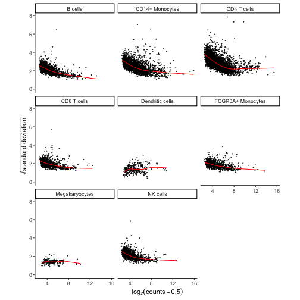

```r
# Show plots for subset of cell clusters
# plotVoom( res.proc[1:3] )

# Show plots for one cell cluster
# plotVoom( res.proc[["B cells"]])
```

# Variance partitioning
The [variancePartition](http://bioconductor.org/packages/variancePartition/) package uses linear and linear mixed models to quanify the contribution of multiple sources of expression variation at the gene-level.  For each gene it fits a linear (mixed) model and evalutes the fraction of expression variation explained by each variable.  

Variance fractions can be visualized at the gene-level for each cell type using a bar plot, or genome-wide using a violin plot.


```r
# run variance partitioning analysis
vp.lst = fitVarPart( res.proc, ~ StimStatus)
```


```r
# Show variance fractions at the gene-level for each cell type
genes = vp.lst$gene[2:4]
plotPercentBars(vp.lst[vp.lst$gene %in% genes,])
```

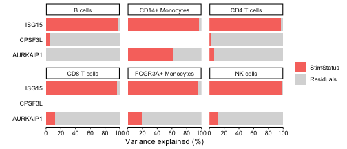


```r
# Summarize variance fractions genome-wide for each cell type
plotVarPart(vp.lst, label.angle=60) 
```

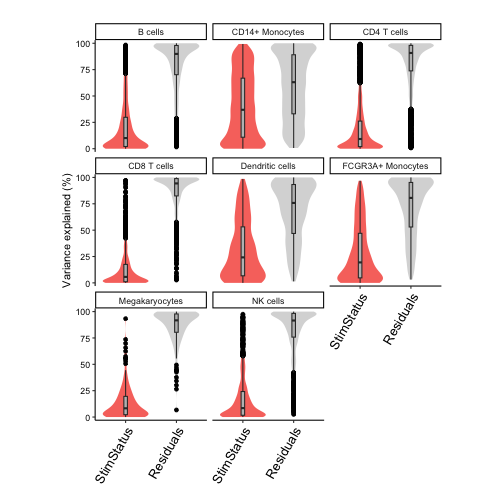


# Differential expression 
Since the normalized expression data and metadata are stored within `res.proc`, only the regression formula remains to be specified.  Here we only included the stimulus status, but analyses of larger datasets can include covariates and random effects. With formula `~ StimStatus`, an intercept is fit and coefficient `StimStatusstim` log fold change between simulated and controls. 


```r
# Differential expression analysis within each assay,
# evaluated on the voom normalized data 
res.dl = dreamlet( res.proc, ~ StimStatus)

# names of estimated coefficients
coefNames(res.dl) 
```

```
## [1] "(Intercept)"    "StimStatusstim"
```

```r
# the resulting object of class dreamletResult
# stores results and other information
res.dl
```

```
## class: dreamletResult 
## assays(8): B cells CD14+ Monocytes ... Megakaryocytes NK cells
## Genes:
##  min: 182 
##  max: 5262 
## details(4): assay n_retain formula formDropsTerms
## coefNames(2): (Intercept) StimStatusstim
```


## Volcano plots
The volcano plot can indicate the strength of the differential expression signal with each cell type.  Red points indicate FDR < 0.05.

```r
plotVolcano( res.dl, coef = 'StimStatusstim' )
```

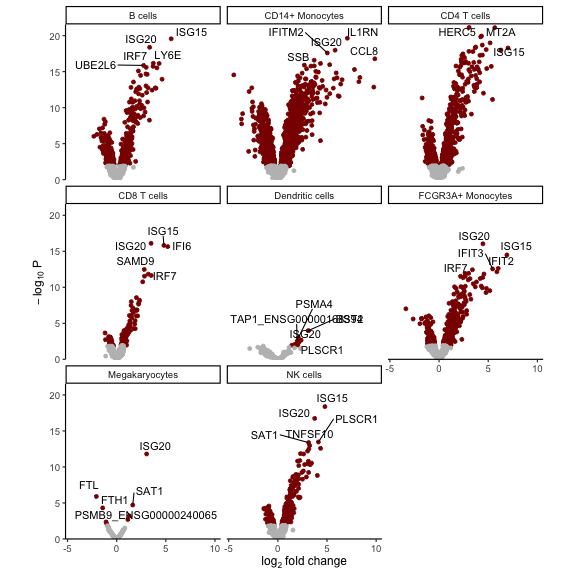

## Gene-level heatmap
For each cell type and specified gene, show z-statistic from `dreamlet` analysis.  Grey indicates that insufficient reads were observed to include the gene in the analysis.

```r
genes = c("ISG20", "ISG15")
plotGeneHeatmap( res.dl, coef="StimStatusstim", genes=genes)
```

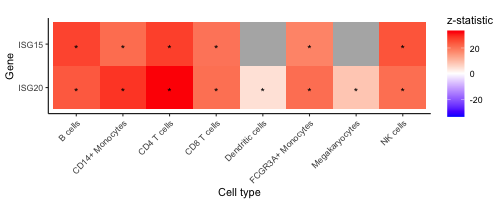

## Extract results
Each entry in `res.dl` stores a model fit by [`dream()`](https://rdrr.io/bioc/variancePartition/man/dream-method.html), and results can be extracted using `topTable()` as in `limma` by specifying the coefficient of interest.  The results shows the gene name, log fold change, average expression, t-statistic, p-value, FDR (i.e. adj.P.Val). 

```r
# results from full analysis
topTable(res.dl, coef = 'StimStatusstim' )
```

```
## DataFrame with 10 rows and 9 columns
##              assay          ID     logFC   AveExpr         t     P.Value
##        <character> <character> <numeric> <numeric> <numeric>   <numeric>
## 1      CD4 T cells       ISG20   3.05572  10.40388   33.5203 7.41254e-22
## 2      CD4 T cells        IFI6   5.66657   8.52892   33.4374 7.86231e-22
## 3      CD4 T cells        MT2A   4.32225   7.80640   29.8773 1.13800e-20
## 4      CD4 T cells       HERC5   4.23328   6.74189   29.5639 1.46058e-20
## 5  CD14+ Monocytes       IL1RN   7.07056   7.79103   34.1843 2.29479e-20
## 6          B cells       ISG15   5.54789  10.20272   26.6421 2.74841e-20
## 7      CD4 T cells       ISG15   5.19158  10.06906   27.2208 1.02600e-19
## 8      CD4 T cells     TNFSF10   4.39746   7.49081   26.4388 2.03723e-19
## 9      CD4 T cells        GBP1   3.73059   7.16795   25.7287 3.86135e-19
## 10         B cells       ISG20   3.35621  11.38360   23.8766 4.16884e-19
##      adj.P.Val         B     z.std
##      <numeric> <numeric> <numeric>
## 1  5.76072e-18   40.0894   33.5203
## 2  5.76072e-18   39.8546   33.4374
## 3  5.35083e-17   37.3049   29.8773
## 4  5.35083e-17   36.8698   29.5639
## 5  6.71252e-17   35.8905   34.1843
## 6  6.71252e-17   36.3706   26.6421
## 7  2.14786e-16   35.2195   27.2208
## 8  3.73169e-16   34.4771   26.4388
## 9  5.57062e-16   33.8603   25.7287
## 10 5.57062e-16   33.7695   23.8766
```

```r
# only B cells
topTable(res.dl[["B cells"]], coef = 'StimStatusstim' )
```

```
##           logFC   AveExpr        t      P.Value    adj.P.Val        B
## ISG15  5.547889 10.202722 26.64210 2.748406e-20 5.389625e-17 36.37060
## ISG20  3.356214 11.383603 23.87659 4.168841e-19 4.087548e-16 33.76953
## IRF7   3.727644  8.678591 19.37431 6.914653e-17 3.645751e-14 28.65759
## LY6E   4.322173  8.706648 19.31609 7.436514e-17 3.645751e-14 28.57344
## UBE2L6 2.739788  9.241028 18.82882 1.377804e-16 5.403746e-14 27.99829
## EPSTI1 3.704608  8.107930 18.60426 1.839271e-16 6.011349e-14 27.65386
## IFITM2 3.004151  8.731566 18.35019 2.559671e-16 7.170736e-14 27.37913
## PLSCR1 4.094465  8.271191 18.22420 3.019961e-16 7.402680e-14 27.17151
## SAT1   2.209092  9.657178 17.48641 8.115557e-16 1.768290e-13 26.21176
## TRIM22 2.982051  7.201113 16.81383 2.062219e-15 4.044012e-13 25.24377
```

## Forest plot 
A forest plot shows the log fold change and standard error of a given gene across all cell types.  The color indicates the FDR. 

```r
plotForest( res.dl, coef = 'StimStatusstim', gene = 'ISG20')
```

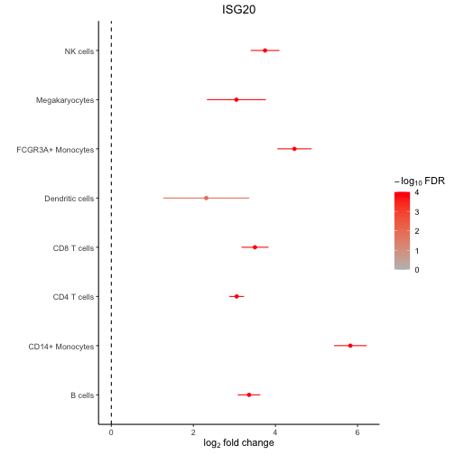


## Advanced used of contrasts
A hypothesis test of the _difference_ between two or more coefficients can be performed using contrasts.  The contrast matrix is evaluated for each cell type in the backend, so only the contrast string must be supplied to `dreamlet()`.  


```r
# create a contrasts called 'Diff' that is the difference between expression
# in the stimulated and controls.
# More than one can be specified
contrasts = c(Diff = 'StimStatusstim - StimStatusctrl')

# Evalaute the regression model without an intercept term.
# Instead estimate the mean expression in stimulated, controls and then
# set Diff to the difference between the two
res.dl2 = dreamlet( res.proc, ~ 0 + StimStatus, contrasts=contrasts)

# see estimated coefficients
coefNames(res.dl2)
```

```
## [1] "Diff"           "StimStatusctrl" "StimStatusstim"
```

```r
# Volcano plot of Diff
plotVolcano( res.dl2[1:2], coef = 'Diff' )
```

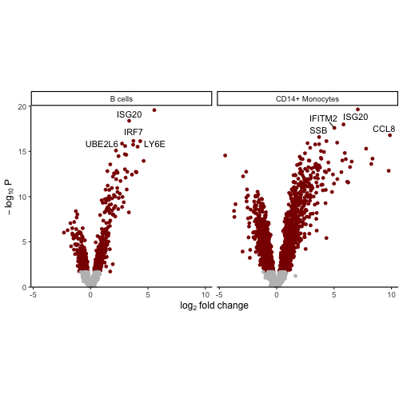

This new `Diff` variable can then be used downstream for analysis asking for a coefficient.  But note that since there is no intercept term in this model, the meaning of `StimStatusstim` changes here.  When the formula is ` 0 + StimStatus` then `StimStatusstim` is the mean expression in stimulated samples.  

For further information about using contrasts see [makeContrastsDream()](https://gabrielhoffman.github.io/variancePartition/reference/makeContrastsDream.html) and [vignette](https://gabrielhoffman.github.io/variancePartition/articles/dream.html#advanced-hypothesis-testing-1).

# Gene set analysis 
While standard enrichment methods like Fishers exact test, requires specifying a FDR cutoff to identify differentially expressed genes.  However, dichotomizing differential expression results is often too simple and ignores the quantitative variation captured by the differential expression test statistics.   Here we use `zenith`, a wrapper for [`limma::camera`](https://rdrr.io/bioc/limma/man/camera.html), to perform gene set analysis using the full spectrum of differential expression test statistics.  `zenith/camera` is a [competetive test](https://www.nature.com/articles/nrg.2016.29) that compares the mean test statistic for genes in a given gene set, to genes not in that set while accounting for correlation between genes.        

Here, `zenith_gsa` takes a `dreamletResult` object, the coefficient of interest, and gene sets as a `GeneSetCollection` object from [GSEABase](https://bioconductor.org/packages/GSEABase/).      


```r
# Load Gene Ontology database 
# use gene 'SYMBOL', or 'ENSEMBL' id
# use get_MSigDB() to load MSigDB
# Use Cellular Component (i.e. CC) to reduce run time here
go.gs = get_GeneOntology("CC", to="SYMBOL")
   
# Run zenith gene set analysis on result of dreamlet
res_zenith = zenith_gsa(res.dl, coef = 'StimStatusstim', go.gs)

# examine results for each ell type and gene set
head(res_zenith)
```

```
##     assay           coef
## 1 B cells StimStatusstim
## 2 B cells StimStatusstim
## 3 B cells StimStatusstim
## 4 B cells StimStatusstim
## 5 B cells StimStatusstim
## 6 B cells StimStatusstim
##                                                        Geneset NGenes
## 1                                GO0022626: cytosolic ribosome     74
## 2                                          GO0005844: polysome     31
## 3                 GO0022625: cytosolic large ribosomal subunit     45
## 4 GO0090575: RNA polymerase II transcription regulator complex     34
## 5                           GO0005839: proteasome core complex     13
## 6                                    GO0005925: focal adhesion    111
##   Correlation      delta        se      p.less  p.greater     PValue Direction
## 1        0.01 -0.9589284 0.3508571 0.008086263 0.99191374 0.01617253      Down
## 2        0.01 -1.2436770 0.4679575 0.009373082 0.99062692 0.01874616      Down
## 3        0.01 -1.0382297 0.4095744 0.011902015 0.98809799 0.02380403      Down
## 4        0.01  1.0512815 0.4523949 0.982150389 0.01784961 0.03569922        Up
## 5        0.01  1.5053843 0.6692082 0.979453711 0.02054629 0.04109258        Up
## 6        0.01 -0.7049635 0.3167453 0.021490079 0.97850992 0.04298016      Down
##         FDR
## 1 0.4217459
## 2 0.4589949
## 3 0.4810112
## 4 0.6020553
## 5 0.6301219
## 6 0.6301219
```

## Heatmap of top genesets

```r
# for each cell type select 5 genesets with largest t-statistic
# and 1 geneset with the lowest
# Grey boxes indicate the gene set could not be evaluted because
#    to few genes were represented
plotZenithResults(res_zenith, 5, 1)
```

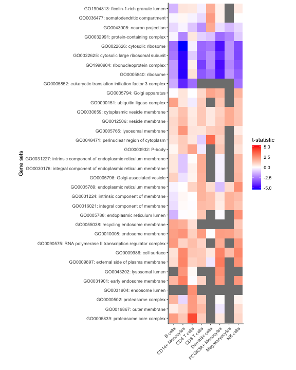

### All gene sets with FDR < 30%
Here, show all genes with FDR < 5% in any cell type

```r
# get genesets with FDR < 30%
# Few significant genesets because uses Cellular Component (i.e. CC) 
gs = unique(res_zenith$Geneset[res_zenith$FDR < 0.3])

# keep only results of these genesets
df = res_zenith[res_zenith$Geneset %in% gs,]

# plot results, but with no limit based on the highest/lowest t-statistic
plotZenithResults(df, Inf, Inf)
```

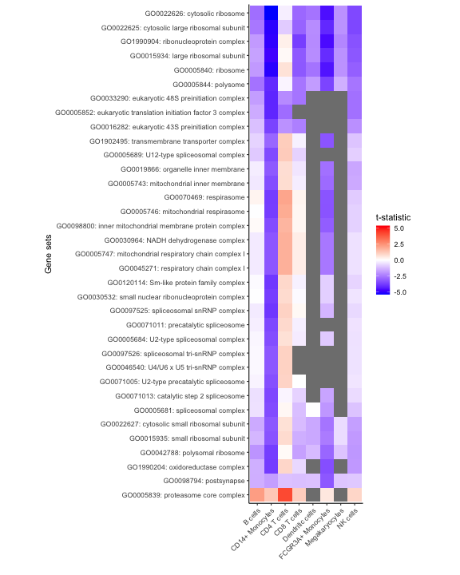


# Comparing expression in clusters
Identifying genes that are differentially expressed between cell clusters incorporates a paired analysis design, since each individual is observed for each cell cluster.    


```r
# test differential expression between B cells and the rest of the cell clusters
ct.pairs = c("CD4 T cells", "rest")
 
fit = dreamletCompareClusters( pb, ct.pairs, method="fixed")

# The coefficient 'compare' is the value logFC between test and baseline:
# compare = cellClustertest - cellClusterbaseline 
df_Bcell = topTable(fit, coef="compare")

head(df_Bcell)
```

```
##                             logFC   AveExpr         t      P.Value    adj.P.Val
## TYROBP                  -7.419602  7.917618 -85.70559 2.370028e-31 1.113913e-27
## FTL                     -4.942146 13.169468 -62.42875 4.587228e-28 1.077999e-24
## CD63                    -5.081503  8.760309 -56.16528 5.698308e-27 8.927349e-24
## C15orf48                -7.290465  8.398874 -51.69563 4.100176e-26 4.817706e-23
## HLA-DRA_ENSG00000204287 -6.424497  8.865795 -49.62863 1.081688e-25 1.016787e-22
## CCL2                    -7.299489  8.725990 -47.80615 2.630893e-25 2.060866e-22
##                                B
## TYROBP                  60.35900
## FTL                     54.38099
## CD63                    51.74976
## C15orf48                49.73396
## HLA-DRA_ENSG00000204287 48.87492
## CCL2                    47.96901
```

# Gene-cluster specificity
Evaluate the specificity of each gene for each cluster, retaining only highly expressed genes:

```r
df_cts = cellTypeSpecificity( pb )
 
# retain only genes with total CPM summed across cell type > 100
df_cts = df_cts[df_cts$totalCPM > 100,]

# Violin plot of specificity score for each cell type
plotViolin(df_cts) 
```

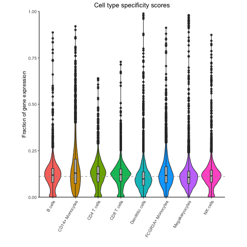

Highlight expression fraction for most specific gene from each cell type:

```r
genes = rownames(df_cts)[apply(df_cts, 2, which.max)]
plotPercentBars( df_cts, genes = genes )
```

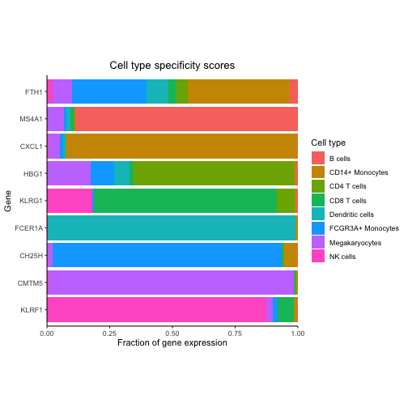

```r
dreamlet::plotHeatmap( df_cts, genes = genes)
```

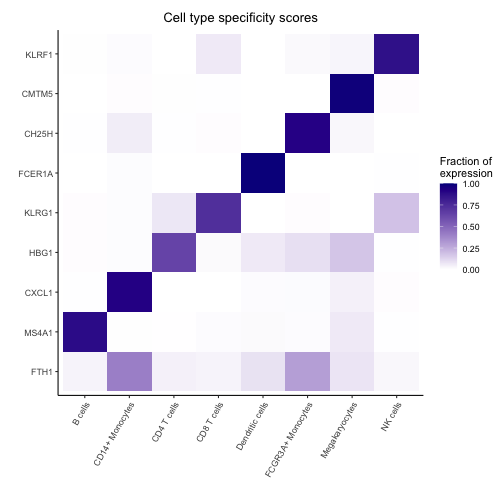

# Session Info
<details>

```
## R version 4.2.0 (2022-04-22)
## Platform: x86_64-apple-darwin19.6.0 (64-bit)
## Running under: macOS Big Sur/Monterey 10.16
## 
## Matrix products: default
## 
## locale:
## [1] en_US.UTF-8/en_US.UTF-8/en_US.UTF-8/C/en_US.UTF-8/en_US.UTF-8
## 
## attached base packages:
## [1] splines   stats4    stats     graphics  grDevices datasets  utils    
## [8] methods   base     
## 
## other attached packages:
##  [1] lme4_1.1-32                 Matrix_1.5-3               
##  [3] muscData_1.10.0             scater_1.24.0              
##  [5] scuttle_1.6.3               SingleCellExperiment_1.18.1
##  [7] SummarizedExperiment_1.26.1 Biobase_2.58.0             
##  [9] GenomicRanges_1.48.0        GenomeInfoDb_1.32.4        
## [11] IRanges_2.30.1              S4Vectors_0.34.0           
## [13] MatrixGenerics_1.8.1        matrixStats_0.63.0         
## [15] ExperimentHub_2.4.0         AnnotationHub_3.4.0        
## [17] BiocFileCache_2.4.0         dbplyr_2.3.1               
## [19] BiocGenerics_0.44.0         muscat_1.11.2              
## [21] dreamlet_0.99.6             variancePartition_1.28.9   
## [23] BiocParallel_1.32.0         limma_3.54.0               
## [25] ggplot2_3.4.1              
## 
## loaded via a namespace (and not attached):
##   [1] estimability_1.4.1            rappdirs_0.3.3               
##   [3] scattermore_0.8               mashr_0.2.57                 
##   [5] coda_0.19-4                   tidyr_1.3.0                  
##   [7] clusterGeneration_1.3.7       bit64_4.0.5                  
##   [9] knitr_1.42                    irlba_2.3.5.1                
##  [11] multcomp_1.4-23               DelayedArray_0.22.0          
##  [13] data.table_1.14.8             KEGGREST_1.36.3              
##  [15] RCurl_1.98-1.10               doParallel_1.0.17            
##  [17] generics_0.1.3                ScaledMatrix_1.4.1           
##  [19] RhpcBLASctl_0.23-42           TH.data_1.1-1                
##  [21] RSQLite_2.3.0                 future_1.32.0                
##  [23] bit_4.0.5                     httpuv_1.6.9                 
##  [25] assertthat_0.2.1              viridis_0.6.2                
##  [27] xfun_0.37                     hms_1.1.2                    
##  [29] babelgene_22.9                evaluate_0.20                
##  [31] promises_1.2.0.1              fansi_1.0.4                  
##  [33] progress_1.2.2                caTools_1.18.2               
##  [35] Rgraphviz_2.40.0              DBI_1.1.3                    
##  [37] geneplotter_1.74.0            purrr_1.0.1                  
##  [39] ellipsis_0.3.2                dplyr_1.1.0                  
##  [41] backports_1.4.1               annotate_1.74.0              
##  [43] aod_1.3.2                     sparseMatrixStats_1.8.0      
##  [45] vctrs_0.5.2                   abind_1.4-5                  
##  [47] cachem_1.0.7                  withr_2.5.0                  
##  [49] emmeans_1.8.5                 sctransform_0.3.5            
##  [51] prettyunits_1.1.1             softImpute_1.4-1             
##  [53] cluster_2.1.4                 crayon_1.5.2                 
##  [55] genefilter_1.78.0             edgeR_3.38.4                 
##  [57] pkgconfig_2.0.3               labeling_0.4.2               
##  [59] nlme_3.1-160                  vipor_0.4.5                  
##  [61] blme_1.0-5                    rlang_1.1.0                  
##  [63] globals_0.16.2                lifecycle_1.0.3              
##  [65] sandwich_3.0-2                filelock_1.0.2               
##  [67] rsvd_1.0.5                    invgamma_1.1                 
##  [69] graph_1.74.0                  ashr_2.2-54                  
##  [71] boot_1.3-28.1                 zoo_1.8-11                   
##  [73] beeswarm_0.4.0                GlobalOptions_0.1.2          
##  [75] png_0.1-8                     viridisLite_0.4.1            
##  [77] rjson_0.2.21                  bitops_1.0-7                 
##  [79] KernSmooth_2.23-20            EnrichmentBrowser_2.26.0     
##  [81] Biostrings_2.64.1             blob_1.2.3                   
##  [83] DelayedMatrixStats_1.18.2     shape_1.4.6                  
##  [85] mixsqp_0.3-48                 stringr_1.5.0                
##  [87] SQUAREM_2021.1                parallelly_1.34.0            
##  [89] remaCor_0.0.11                rmeta_3.0                    
##  [91] beachmat_2.12.0               scales_1.2.1                 
##  [93] memoise_2.0.1                 GSEABase_1.58.0              
##  [95] magrittr_2.0.3                plyr_1.8.8                   
##  [97] gplots_3.1.3                  zlibbioc_1.42.0              
##  [99] compiler_4.2.0                RColorBrewer_1.1-3           
## [101] clue_0.3-64                   KEGGgraph_1.56.0             
## [103] DESeq2_1.36.0                 cli_3.6.0                    
## [105] XVector_0.36.0                lmerTest_3.1-3               
## [107] listenv_0.9.0                 TMB_1.9.1                    
## [109] MASS_7.3-58.3                 tidyselect_1.2.0             
## [111] stringi_1.7.12                highr_0.10                   
## [113] zenith_1.1.1                  yaml_2.3.7                   
## [115] BiocSingular_1.12.0           locfit_1.5-9.7               
## [117] ggrepel_0.9.3                 grid_4.2.0                   
## [119] tools_4.2.0                   future.apply_1.10.0          
## [121] parallel_4.2.0                circlize_0.4.15              
## [123] foreach_1.5.2                 gridExtra_2.3                
## [125] farver_2.1.1                  RcppZiggurat_0.1.6           
## [127] digest_0.6.31                 BiocManager_1.30.20          
## [129] shiny_1.7.4                   Rcpp_1.0.10                  
## [131] broom_1.0.4                   BiocVersion_3.15.2           
## [133] later_1.3.0                   httr_1.4.5                   
## [135] AnnotationDbi_1.58.0          ComplexHeatmap_2.12.1        
## [137] Rdpack_2.4                    colorspace_2.1-0             
## [139] XML_3.99-0.13                 truncnorm_1.0-8              
## [141] xtable_1.8-4                  nloptr_2.0.3                 
## [143] Rfast_2.0.6                   R6_2.5.1                     
## [145] RUnit_0.4.32                  pillar_1.8.1                 
## [147] htmltools_0.5.4               mime_0.12                    
## [149] glue_1.6.2                    fastmap_1.1.1                
## [151] minqa_1.2.5                   BiocNeighbors_1.14.0         
## [153] interactiveDisplayBase_1.34.0 codetools_0.2-19             
## [155] mvtnorm_1.1-3                 utf8_1.2.3                   
## [157] lattice_0.20-45               tibble_3.2.0                 
## [159] numDeriv_2016.8-1.1           pbkrtest_0.5.2               
## [161] curl_5.0.0                    ggbeeswarm_0.7.1             
## [163] gtools_3.9.4                  survival_3.5-5               
## [165] glmmTMB_1.1.5                 munsell_0.5.0                
## [167] GetoptLong_1.0.5              GenomeInfoDbData_1.2.8       
## [169] iterators_1.0.14              reshape2_1.4.4               
## [171] gtable_0.3.1                  msigdbr_7.5.1                
## [173] rbibutils_2.2.13
```
</details>


