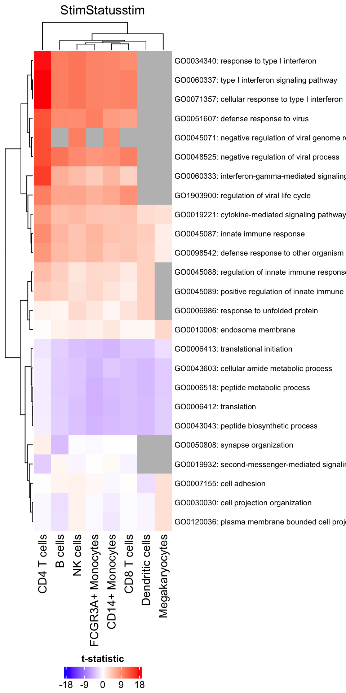
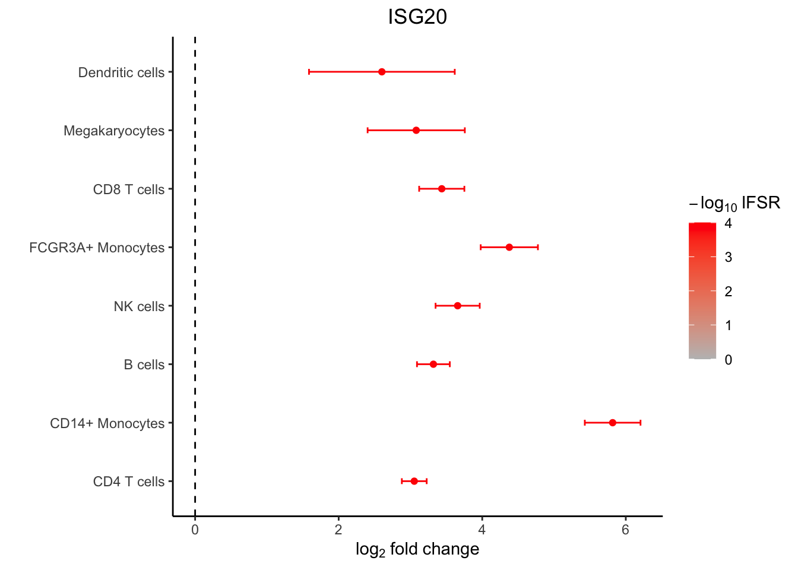
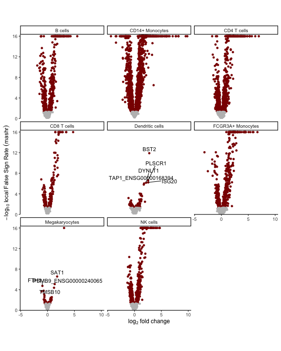

<!---

cd /Users/gabrielhoffman/workspace/repos/variancePartition/vignettes

# rm -rf dreamlet_cache/

rmarkdown::render("mashr.Rmd")


 devtools::reload("/Users/gabrielhoffman/workspace/repos/dreamlet")

devtools::reload("/Users/gabrielhoffman/workspace/repos/zenith")


--->


<style>
body {
text-align: justify}
</style>


# Instroduction
[mashr](https://cran.r-project.org/web/packages/mashr/index.html) is a Bayesian statistical method to borrow information across genes and cell type [(Urbut, et al, 2019)](https://doi.org/10.1038%2Fs41588-018-0268-8).  [mashr](https://cran.r-project.org/web/packages/mashr/index.html) takes estimated log fold changes and standard errors for each cell type and gene from `dreamlet`, and produces posterior estimates with more accuracy and precision then the original parameter estimates.


# Standard `dreamlet` analysis
## Preprocess data
Here single cell RNA-seq data is downloaded from [ExperimentHub](https://bioconductor.org/packages/ExperimentHub/)


```r
library(dreamlet)
library(muscat)
library(ExperimentHub)
library(zenith)
library(scater)

# Download data, specifying EH2259 for the Kang, et al study
eh <- ExperimentHub()
sce <- eh[["EH2259"]]

# only keep singlet cells with sufficient reads
sce <- sce[rowSums(counts(sce) > 0) > 0, ]
sce <- sce[,colData(sce)$multiplets == 'singlet']

# compute QC metrics
qc <- perCellQCMetrics(sce)

# remove cells with few or many detected genes
ol <- isOutlier(metric = qc$detected, nmads = 2, log = TRUE)
sce <- sce[, !ol]

# compute normalized data
sce <- sce[rowSums(counts(sce) > 1) >= 10, ]
sce <- computeLibraryFactors(sce)
sce <- logNormCounts(sce)

# set variable indicating stimulated (stim) or control (ctrl)
sce$StimStatus = sce$stim
```


## Aggregate to pseudobulk


```r
# Since 'ind' is the individual and 'StimStatus' is the stimulus status,
# create unique identifier for each sample
sce$id <- paste0(sce$StimStatus, sce$ind)

# Create pseudobulk data by specifying cluster_id and sample_id
# Count data for each cell type is then stored in the `assay` field
# assay: entry in assayNames(sce) storing raw counts
# cluster_id: variable in colData(sce) indicating cell clusters
# sample_id: variable in colData(sce) indicating sample id for aggregating cells
pb <- aggregateToPseudoBulk(sce,
    assay = "counts",     
    cluster_id = "cell",  
    sample_id = "id",
    verbose = FALSE)
```

## `dreamlet` for pseudobulk     

```r
# Normalize and apply voom/voomWithDreamWeights
res.proc = processAssays( pb, ~ StimStatus, min.count=5)

# Differential expression analysis within each assay,
# evaluated on the voom normalized data 
res.dl = dreamlet( res.proc, ~ StimStatus)
```

# Run `mashr` analysis

```r
# run mashr model to borrow information across genes and
# cell types in estimating coefficients' posterior distribution
res_mash = run_mash(res.dl, coef='StimStatusstim')
```

### Summarize `mashr` results
Compute summary of mashr posterior distributions

```r
library(mashr)

# extract statistics from mashr model
# NA values indicate genes not sufficiently expressed
# in a given cell type

# original logFC
head(res_mash$logFC.original)[1:4, 1:4]
```

```
##       B cells CD14+ Monocytes CD4 T cells CD8 T cells
## A1BG       NA              NA -0.73718671          NA
## AAAS       NA              NA -0.56991157          NA
## AAED1      NA        1.426001  0.07140051          NA
## AAK1       NA              NA -0.91972740          NA
```

```r
# posterior mean for logFC
head(get_pm(res_mash$model))[1:4, 1:4]
```

```
##       B cells CD14+ Monocytes CD4 T cells CD8 T cells
## A1BG       NA              NA  -0.6327307          NA
## AAAS       NA              NA  -0.4543872          NA
## AAED1      NA        1.378843   0.0201326          NA
## AAK1       NA              NA  -0.8578750          NA
```

```r
# how many gene-by-celltype tests are significant
# i.e.  if a gene is significant in 2 celltypes, it is counted twice
table(get_lfsr(res_mash$model) < 0.05, useNA="ifany")
```

```
## 
## FALSE  TRUE  <NA> 
##  8089  6073 30134
```

```r
# how many genes are significant in at least one cell type
table( apply(get_lfsr(res_mash$model), 1, min, na.rm=TRUE) < 0.05)
```

```
## 
## FALSE  TRUE 
##  2568  2969
```

```r
# how many genes are significant in each cell type
apply(get_lfsr(res_mash$model), 2, function(x) sum(x < 0.05, na.rm=TRUE))
```

```
##           B cells   CD14+ Monocytes       CD4 T cells       CD8 T cells 
##               767              2086              1525               412 
##   Dendritic cells FCGR3A+ Monocytes    Megakaryocytes          NK cells 
##                52               566                36               629
```

```r
# examine top set of genes
# which genes are significant in at least 1 cell type
sort(names(get_significant_results(res_mash$model)))[1:10]
```

```
##  [1] "ACTB"                  "ACTG1_ENSG00000184009" "ARPC1B"               
##  [4] "ATP6V0E1"              "B2M"                   "BTF3"                 
##  [7] "BTG1"                  "CALM2"                 "CD74"                 
## [10] "CFL1"
```

```r
# There is a lot of variation in the raw logFC
res_mash$logFC.original["ISG20",]
```

```
##           B cells   CD14+ Monocytes       CD4 T cells       CD8 T cells 
##          3.200534          5.865638          3.060855          3.533391 
##   Dendritic cells FCGR3A+ Monocytes    Megakaryocytes          NK cells 
##          3.593594          4.370017                NA          3.577744
```

```r
# posterior mean after borrowing across cell type and genes
get_pm(res_mash$model)["ISG20",]
```

```
##           B cells   CD14+ Monocytes       CD4 T cells       CD8 T cells 
##          3.201633          5.807546          3.063965          3.535864 
##   Dendritic cells FCGR3A+ Monocytes    Megakaryocytes          NK cells 
##          3.601904          4.350143                NA          3.577692
```

### Gene set analysis 
Perform gene set analysis with `zenith` using posterior mean for each coefficient

```r
# gene set analysis using mashr results
library(zenith)

# Load Gene Ontology database 
# use gene 'SYMBOL', or 'ENSEMBL' id
# use get_MSigDB() to load MSigDB 
go.gs = get_GeneOntology("CC", to="SYMBOL")

# valid values for statistic: 
# "tstatistic", "abs(tstatistic)", "logFC", "abs(logFC)"
df_gs = zenith_gsa(res_mash, go.gs)

# Heatmap of results
plotZenithResults(df_gs, 5, 1)
```




```r
# forest plot based on mashr results
plotForest(res_mash, "ISG20") 
```



Volcano plot based on local False Sign Rate (lFSR) estimated from the posterior distribution of each coefficient.


```r
# volcano plot based on mashr results
# yaxis uses local false sign rate (lfsr)
plotVolcano(res_mash)
```




# Session Info
<details>

```
## R version 4.3.0 (2023-04-21)
## Platform: x86_64-apple-darwin22.4.0 (64-bit)
## Running under: macOS Ventura 13.4
## 
## Matrix products: default
## BLAS:   /Users/gabrielhoffman/prog/R-4.3.0/lib/libRblas.dylib 
## LAPACK: /usr/local/Cellar/r/4.3.0_1/lib/R/lib/libRlapack.dylib;  LAPACK version 3.11.0
## 
## locale:
## [1] en_US.UTF-8/en_US.UTF-8/en_US.UTF-8/C/en_US.UTF-8/en_US.UTF-8
## 
## time zone: America/New_York
## tzcode source: internal
## 
## attached base packages:
## [1] stats4    stats     graphics  grDevices datasets  utils     methods  
## [8] base     
## 
## other attached packages:
##  [1] GO.db_3.17.0                org.Hs.eg.db_3.17.0        
##  [3] AnnotationDbi_1.62.1        mashr_0.2.69               
##  [5] ashr_2.2-54                 muscData_1.14.0            
##  [7] scater_1.28.0               scuttle_1.10.1             
##  [9] SingleCellExperiment_1.22.0 SummarizedExperiment_1.30.1
## [11] Biobase_2.60.0              GenomicRanges_1.52.0       
## [13] GenomeInfoDb_1.36.0         IRanges_2.34.0             
## [15] S4Vectors_0.38.1            MatrixGenerics_1.12.0      
## [17] matrixStats_1.0.0           zenith_1.2.0               
## [19] ExperimentHub_2.8.0         AnnotationHub_3.8.0        
## [21] BiocFileCache_2.8.0         dbplyr_2.3.2               
## [23] BiocGenerics_0.46.0         muscat_1.14.0              
## [25] dreamlet_0.99.20            variancePartition_1.31.11  
## [27] BiocParallel_1.34.2         limma_3.56.2               
## [29] ggplot2_3.4.2              
## 
## loaded via a namespace (and not attached):
##   [1] bitops_1.0-7                  httr_1.4.6                   
##   [3] RColorBrewer_1.1-3            doParallel_1.0.17            
##   [5] Rgraphviz_2.44.0              numDeriv_2016.8-1.1          
##   [7] tools_4.3.0                   sctransform_0.3.5            
##   [9] backports_1.4.1               utf8_1.2.3                   
##  [11] R6_2.5.1                      GetoptLong_1.0.5             
##  [13] withr_2.5.0                   prettyunits_1.1.1            
##  [15] gridExtra_2.3                 cli_3.6.1                    
##  [17] labeling_0.4.2                KEGGgraph_1.60.0             
##  [19] SQUAREM_2021.1                mvtnorm_1.2-2                
##  [21] blme_1.0-5                    mixsqp_0.3-48                
##  [23] parallelly_1.36.0             invgamma_1.1                 
##  [25] RSQLite_2.3.1                 generics_0.1.3               
##  [27] shape_1.4.6                   gtools_3.9.4                 
##  [29] dplyr_1.1.2                   Matrix_1.5-4.1               
##  [31] ggbeeswarm_0.7.2              fansi_1.0.4                  
##  [33] abind_1.4-5                   lifecycle_1.0.3              
##  [35] yaml_2.3.7                    edgeR_3.42.4                 
##  [37] gplots_3.1.3                  grid_4.3.0                   
##  [39] blob_1.2.4                    promises_1.2.0.1             
##  [41] crayon_1.5.2                  lattice_0.21-8               
##  [43] beachmat_2.16.0               msigdbr_7.5.1                
##  [45] annotate_1.78.0               KEGGREST_1.40.0              
##  [47] pillar_1.9.0                  knitr_1.43                   
##  [49] ComplexHeatmap_2.16.0         rjson_0.2.21                 
##  [51] boot_1.3-28.1                 corpcor_1.6.10               
##  [53] future.apply_1.11.0           codetools_0.2-19             
##  [55] glue_1.6.2                    data.table_1.14.8            
##  [57] vctrs_0.6.3                   png_0.1-8                    
##  [59] Rdpack_2.4                    gtable_0.3.3                 
##  [61] assertthat_0.2.1              cachem_1.0.8                 
##  [63] xfun_0.39                     rbibutils_2.2.13             
##  [65] S4Arrays_1.0.4                mime_0.12                    
##  [67] Rfast_2.0.7                   iterators_1.0.14             
##  [69] interactiveDisplayBase_1.38.0 ellipsis_0.3.2               
##  [71] nlme_3.1-162                  pbkrtest_0.5.2               
##  [73] bit64_4.0.5                   progress_1.2.2               
##  [75] EnvStats_2.7.0                filelock_1.0.2               
##  [77] TMB_1.9.4                     irlba_2.3.5.1                
##  [79] vipor_0.4.5                   KernSmooth_2.23-21           
##  [81] colorspace_2.1-0              rmeta_3.0                    
##  [83] DBI_1.1.3                     DESeq2_1.40.1                
##  [85] tidyselect_1.2.0              bit_4.0.5                    
##  [87] compiler_4.3.0                curl_5.0.0                   
##  [89] graph_1.78.0                  BiocNeighbors_1.18.0         
##  [91] DelayedArray_0.26.3           scales_1.2.1                 
##  [93] caTools_1.18.2                remaCor_0.0.17               
##  [95] rappdirs_0.3.3                stringr_1.5.0                
##  [97] digest_0.6.31                 minqa_1.2.5                  
##  [99] aod_1.3.2                     XVector_0.40.0               
## [101] RhpcBLASctl_0.23-42           htmltools_0.5.5              
## [103] pkgconfig_2.0.3               lme4_1.1-33                  
## [105] sparseMatrixStats_1.12.0      highr_0.10                   
## [107] fastmap_1.1.1                 rlang_1.1.1                  
## [109] GlobalOptions_0.1.2           shiny_1.7.4                  
## [111] DelayedMatrixStats_1.22.0     farver_2.1.1                 
## [113] BiocSingular_1.16.0           RCurl_1.98-1.12              
## [115] magrittr_2.0.3                GenomeInfoDbData_1.2.10      
## [117] munsell_0.5.0                 Rcpp_1.0.10                  
## [119] babelgene_22.9                viridis_0.6.3                
## [121] EnrichmentBrowser_2.30.1      RcppZiggurat_0.1.6           
## [123] stringi_1.7.12                zlibbioc_1.46.0              
## [125] MASS_7.3-60                   plyr_1.8.8                   
## [127] parallel_4.3.0                listenv_0.9.0                
## [129] ggrepel_0.9.3                 Biostrings_2.68.1            
## [131] splines_4.3.0                 hms_1.1.3                    
## [133] circlize_0.4.15               locfit_1.5-9.7               
## [135] reshape2_1.4.4                ScaledMatrix_1.8.1           
## [137] BiocVersion_3.17.1            XML_3.99-0.14                
## [139] evaluate_0.21                 BiocManager_1.30.20          
## [141] nloptr_2.0.3                  foreach_1.5.2                
## [143] httpuv_1.6.11                 tidyr_1.3.0                  
## [145] purrr_1.0.1                   future_1.32.0                
## [147] clue_0.3-64                   scattermore_1.1              
## [149] rsvd_1.0.5                    broom_1.0.5                  
## [151] xtable_1.8-4                  fANCOVA_0.6-1                
## [153] later_1.3.1                   viridisLite_0.4.2            
## [155] truncnorm_1.0-9               tibble_3.2.1                 
## [157] lmerTest_3.1-3                glmmTMB_1.1.7                
## [159] memoise_2.0.1                 beeswarm_0.4.0               
## [161] cluster_2.1.4                 globals_0.16.2               
## [163] GSEABase_1.62.0
```
</details>


